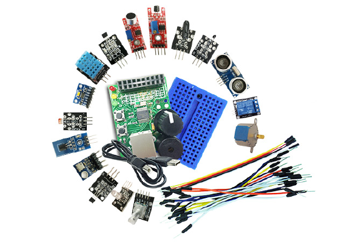

The first course will touch on the fundamentals of IoT. After a short history of the creation of IoT, the course will explain briefly what IoT is and why it is important.
It will also show some of its application use cases and domains.

[Video](https://drive.google.com/file/d/1CqTnLfiC4t9jj7or6Kp3Z0zaXemS5PIp/view)

The term “Internet of Things” was coined by Kevin Ashton in 1999. 
Ashton, who was working in supply chain optimization, wanted to attract senior management’s attention to a new exciting technology called RFID. 
Because the internet was the hottest new trend in 1999, he called his presentation “Internet of Things”.

The internet of things is an extension of the current internet, further into the physical world.
We can collect data from the physical world using sensors and also effect changes in the physical world using actuators or effectors.

IoT is increasingly becoming popular because of advances in smartphone technology, internet connectivity, wearables and its relationship with open source, big data, security and privacy and software-defined networking.

The applications of IoT are wide: wearables, smart home automation, precision agriculture, smart city...
It is pervasing both consumer industrial worlds.

Finally, the challenges facing IoT are the security, the lack of strong regulations, availability of skilled talent, compatibility, bandwidth and customer expectations.

