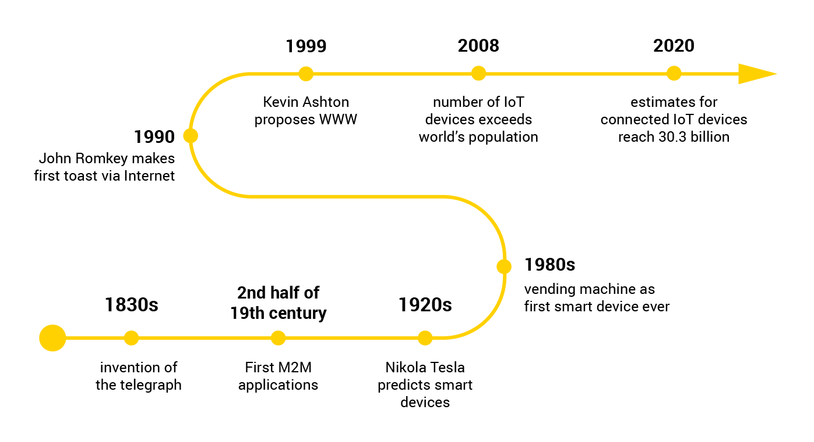
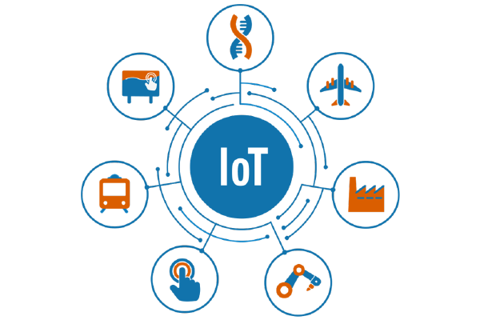
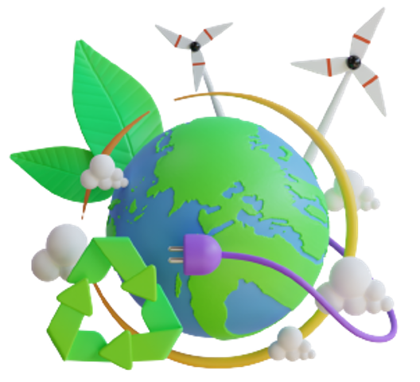
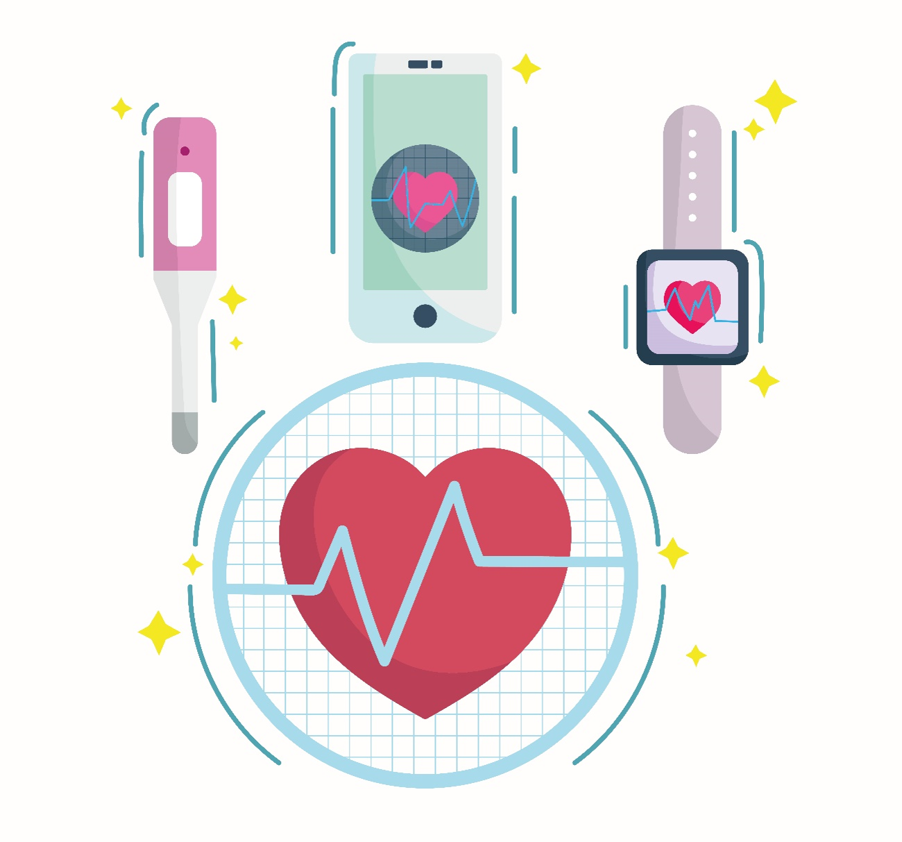
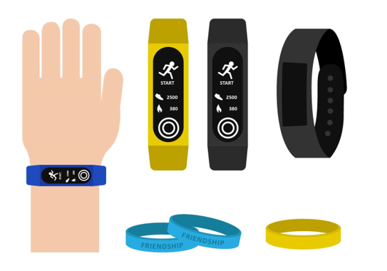
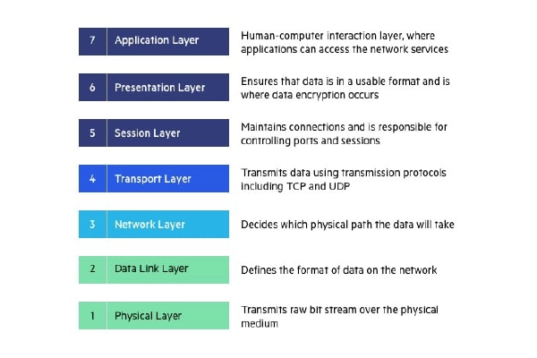

# Introduction to IoT

The first course will touch on the fundamentals of IoT. After a short history of the creation of IoT, the course will explain briefly what IoT is and why it is important.
It will also show some of its application use cases and domains.

<youtube>IIgDQbp2-dY</youtube>

## History of the Internet of Things

The emergence of the first devices with internet connectivity in the early 1980s marked the beginning of the Internet of Things. Wi-Fi and Bluetooth's invention made it possible for devices to connect wirelessly (without any cable connections). IoT's first stages mostly were RFID Radio Frequency Identification technology. RFID made it possible to monitor and identify anything via radio waves. RFID tags were fixed to items, and they could be scanned to get data and find out where they were.

Kevin Ashton who was working in supply chain optimization, wanted to attract senior management’s attention to this new exciting technology. Because the internet was the hottest new trend in 1999, he called his presentation “Internet of Things”.

<!--  -->

<figure src="img/iot-timeline.png" maxWidth="600px" cation="iot-timeline"></figure>

<!-- ## Why is IoT Popular Now?

IoT is increasingly becoming popular because of  advances in smartphone technology, internet connectivity, wearables and its relationship with open source, big data, security and privacy and software-defined networking. 

-->

## What is IoT?
The last decade has witnessed a surge in attention towards the Internet of Things (IoT), a paradigm that involves the connection of physical objects to the internet. These objects, encompassing machinery, automobiles, structures, and various items, collectively form the Internet of Things, equipped with firmware, internet connectivity, and sensor technologies.

This era marks a transformative shift, enabling machines to communicate not only with people but also with each other, courtesy of the IoT concept. The application of IoT technology extends to diverse domains such as smart homes, smart cities, industrial machinery, and wearable technologies.

Industries are experiencing a profound impact from the increasing integration of IoT. Reshaping sectors like manufacturing, transportation, agriculture, and healthcare, IoT is ushering in unprecedented changes. Its influence on the future is undeniable, promising significant transformations.

<!-- The internet of Things is the extension of the internet we already know and use, further into our physical world. This is achieved by the use of sensors, actuators and effectors. -->

<!--  -->
<!-- 

Smart devices can perform tasks with some degree of automation or user interaction.

Connected devices can communicate with other devices or networks, often over the internet.

IoT devices are a subset of connected devices that are designed to collect and exchange data with minimal human intervention for various applications. -->

## Types of IoT Devices
The internet of Things is the extension of the internet we already know and use, further into our physical world. This is achieved by the use of sensors, actuators and effectors. These devices are a subset of connected devices that are designed to collect and exchange data with minimal human intervention for various applications.

IoT devices can generally be grouped into 3 categories namely- **Consumer IoT, Enterprise IoT** and **Industrial IoT (IoT)**

**Consumer IoT** devices are physical personal devices like wearables and home appliances that gather data, and then uses that data to provide insights or take an automated action.

**Enterprise IoT** devices refer to the use of Physical 'things’, thus IoT devices in business processes for reducing manual work and increasing overall business efficiency. A typical example will be the use of IoT devices in logistics and automatic tracking and logging of the where abouts of shipments.

**Industrial IoT** refers to Interconnected sensors, instruments, and other devices networked together with computers for industrial applications, including manufacturing and energy management.

## IoT Scopes

### Agriculture
The scope of IoT in agriculture is nothing short of revolutionary, promising a future where precision and efficiency converge to redefine farming practices. By deploying advanced sensors, automated machinery, and real-time data analytics, IoT enables farmers to monitor crop health, optimize irrigation, and precisely manage resources. Smart agriculture facilitates timely decision-making, minimizes waste, and maximizes yield. From remote sensing technologies to smart drones, the integration of IoT in agriculture not only boosts productivity but also promotes sustainable and resource-efficient farming methods. As the world grapples with the challenge of feeding a growing population, the transformative potential of IoT in agriculture emerges as a beacon of innovation, offering a path towards resilient, data-driven, and eco-friendly farming practices.

<!--  -->

### Energy
<!-- With IoT, it is easier to limit the consumption of electricity and fuel. For instance Smart homes are able to automatically self regulate and dissable appliances when not in use or turn of lights when no one in a room and give real-time updates on energy consumption. -->
In the energy sector, IoT catalyzes transformative change, revolutionizing how power is produced, distributed, and consumed. The interconnected network of devices, sensors, and grids enables real-time monitoring, optimizing energy use for both consumers and providers. Empowered by IoT, smart grids dynamically respond to demand fluctuations, enhancing overall grid reliability. The impact extends from intelligently managing energy consumption in smart homes to streamlining operations in industrial setups. IoT not only boosts energy efficiency but also paves the way for seamless integration of renewable sources, aligning with global sustainability goals. The marriage of IoT and energy signifies not just innovation but a fundamental reimagining of our approach to power in a connected, intelligent future.

<!--  -->

### Health Care
<!-- Remote patient monitoring, real-time data analysis and operational efficiency through connected devices and systems. It has the potential to enhance disease management, reduce healthcare costs, and provide personalized healthcare solutions. -->

In the dynamic landscape of healthcare, IoT unfolds as a catalyst for profound change, ushering in an epoch where personalized, data-centric health management takes center stage. With an array of connected devices, wearables, and intelligent healthcare systems, real-time monitoring becomes not just a possibility but a personalized reality for individuals. Empowering patients to actively engage in their well-being, IoT in health extends its reach to healthcare providers, offering precise insights and timely interventions. Beyond individual care, the impact reverberates across the healthcare spectrum, influencing infrastructure with remote patient monitoring, predictive equipment maintenance, and optimized operations. This technological revolution signifies not only an improvement in diagnostics and treatment outcomes but also a paradigm shift towards preventive healthcare, making IoT a transformative force in shaping the future of well-being.

<!--  -->

### Transportation

<!-- This can be beneficial to owners in terms of fuel usage, emissions per trip, notifications on a car or spare part malfunctioning, driver behavior, speed limiter, geographic locations, door and trunk lock/unlock, social media sharing and more. -->
In transportation, IoT promises unparalleled efficiency and safety. By connecting vehicles and infrastructure, real-time data analytics optimize traffic flow, enable predictive vehicle maintenance, and enhance safety measures. This translates into reduced congestion, lower emissions, and streamlined supply chains. From smart logistics to connected cars improving route efficiency, the benefits of IoT in transportation are tangible, steering us towards a future where mobility is not only connected but also smart, safe, and environmentally conscious.

<!--  -->

## Applications of IoT
### Wearables

**Wearable technology** is a hallmark of IoT applications and is one of the earliest industries to have adopted IoT Technologies. 

These wearables provide real-time insights, promoting healthier lifestyles and enabling remote healthcare monitoring and analysis.

**Smart Home Application** These smart home devices monitor and/or control home attributes such as lighting, climate, entertainment systems, and appliances. It is the highest IoT application on all measured channels.

**Health Care** IoT applications can turn reactive medical-based systems into proactive wellness-based systems. IoT opens ways to a sea of valuable data through analysis, real-time field data, and testing. 

**Smart City Applications** These include traffic management to water distribution, waste management, urban security and environmental monitoring to solve traffic congestion problems, reduce noise and pollution and help make cities safer.

**Agricultural Applications** To feed the world’s ever-growing population, one needs to marry agriculture to technology and obtain best results. There are numerous possibilities in this field. One of them is Smart Farming, this is also known as precision agriculture.

**Industrial Automation** This is one of the fields where both faster developments, as well as the quality of products, are the critical factors for a higher ROI. With IoT Applications, one could even re-engineer products and their packaging to deliver better performance in both cost and customer experience.

Lets take a look at some of the activities and advantages of Iot in Industrial Automation

## Challenges Facing IoT

- ### Security
    The interconnected nature of these devices creates a vast attack surface, making them susceptible to cyber threats. Issues such as insufficient encryption, weak authentication, and the sheer volume of devices make safeguarding IoT networks complex, requiring robust security measures to protect against potential breaches and unauthorized access.

- ### Regulations – Lack of Strong Regulations
    Without stringent guidelines, the industry faces issues related to privacy, data protection, and standardization. This lack of oversight can lead to inconsistent security practices, making it difficult to address potential risks and vulnerabilities effectively. Establishing clear and comprehensive regulations is crucial for ensuring the responsible development and deployment of IoT technologies.

- ### Availability of skilled Talent
    As the demand for professionals with expertise in areas such as cybersecurity, data analytics, and IoT architecture increases, a shortage of qualified individuals hinders the seamless development and maintenance of IoT systems. Bridging this skills gap is essential for effectively addressing the complexities of IoT implementation and ensuring the continued innovation and security of interconnected devices.

- ### Compatibility
    The diverse array of devices, protocols, and standards within the IoT ecosystem often leads to interoperability issues. Ensuring seamless communication and integration among various devices becomes challenging, hindering the potential for a unified and efficient IoT infrastructure. Addressing compatibility concerns is crucial for fostering a cohesive and interconnected environment that maximizes the benefits of IoT technology.

- ### Bandwidth
    The increasing number of connected devices generates substantial data traffic, placing strain on existing network infrastructures. Limited bandwidth can result in slower data transfer, latency issues, and potential disruptions in communication between IoT devices. Overcoming bandwidth limitations is crucial for ensuring the efficient and real-time exchange of data, facilitating the seamless functionality of interconnected devices in various applications, from smart cities to industrial IoT deployments.

- ### Customer Expectations
    As consumers become more tech-savvy, they anticipate seamless integration, user-friendly interfaces, and enhanced functionalities from IoT devices. Striking a balance between innovation and user satisfaction becomes crucial. Managing evolving expectations, addressing privacy concerns, and delivering reliable, intuitive IoT solutions are key factors in navigating this challenge successfully. Adapting to and exceeding customer expectations is essential for the sustained growth and acceptance of IoT technologies in the market.

## Importance of the Right Choice of Technology

- ### Time & Cost
    The right IoT technology streamlines processes, reducing development time and costs, accelerating deployment.

- ### Support
    Robust support ensures IoT system reliability, quick issue resolution, and overall operational stability.

- ### Integrations
    Proper technology choices facilitate seamless integration, enhancing interoperability and the overall effectiveness of the IoT ecosystem.

- ### Business fit & Innovation
    Aligning technology with business needs fosters innovation, driving IoT solutions that meet industry demands and enable sustained growth.

IoT Architecture
================

There is no single consensus on an architecture for IoT, which is agreed on universally.
However, different architectures have been proposed by different researchers.
The 3 and 5 layer architectures are the most widely used. However the 3 layer is the most commonly used so in this lecture we will look at the 3 layer architecture. The three first layers are: 
- *The perception layer* has sensors for sensing and gathering information about the environment.
- *The transport layer* allows to connect together to the smart things, network devices, and servers. It also transmits and processes sensor data.
- *The application layer* delivers application specific services to the user. It defines various applications in which the Internet of Things can be deployed.

Additionally, we sometimes add two more layers:
- *The business layer* manages the whole IoT system, including applications, business and profit models, and users’ privacy.
- *The processing layer*, also known as the middleware or edge layer, allows to process, store and analyze sensor data.

In Waziup, we divide the architecture in three layers:

WaziDev is a development platform, capable of sending data through LoRaWAN to the WaziGate.
The WaziGate processes locally the data and forwards it to the WaziCloud, were the user applications lives.
More on this in Waziup module!

Networking & protocols
=======================

Protocols are systems of rules and procedures that allow two or more entities to communicate.
The TCP/IP protocol stack is at the heart of the Internet, which is the “I” in IoT, or course!
It can be represented using the OSI seven-layer reference model.

Here are few protocols used with IoT:
- *HTTP* is the foundation of the client-server model used for the Web. The more secure method to implement HTTP is to include only a client in your IoT device, not a server
- *WebSocket* is a protocol that provides full-duplex communication over a single TCP connection between client and server.
- *CoAP* is for use with low-power and constrained networks. CoAP is a RESTful protocol.
- *MQTT* is a publish/subscribe messaging transport that is extremely lightweight and ideal for connecting small devices to constrained networks.

Radio communications
====================

Radio communications are an essential part of IoT.

Our course on radio communications will introduce the basics of wireless communications: wireless transmission fundamentals including radio propagation models, antenna technologies, wireless link budget and the relationship between modulation, throughput, energy and transmission range.

Web & mobile IoT applications
=============================

A complete IoT application should always include a web or mobile application.
Our course will show you how to develop a Web interface for your IoT application. At first, we will develop a very simple Web application, based solely on HTML and Javascript. We will build on this knowledge to go to the next step: the Web frameworks. We will show the basics of three of the most popular frameworks: ReactJS, Angular and Vue.

Data analysis and AI
====================

When people think of AI, most of them think of Artificial General Intelligence (AGI). An AGI can do everything what humans do (and even better). But the sad truth is, that mankind is not even close to develop a "real AGI". Nowadays AI is very focused on some specific use cases, therefore one can speak of a Artificial Narrow Intelligence (ANI). Because you train it on a specific thing its capabilities are limited. If you try to use it for another task, it will not perform like you would expect it. AI is separated in many subfields, in this lesson we will elaborate on some of them:

    Machine Learning (ML)
    Deep Leaning (DL)
    Computer Vision (CV)
    Natural Language Processing (NLP)

Business support
================

We also provide business support for creating your IoT startup. Please checkout our courses on business, for instance how to build a business canvas.
