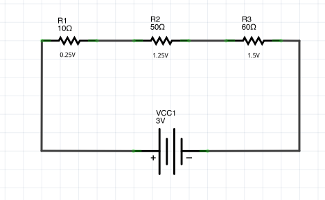

Current, voltage, wires… IoT is, at its base, just electronics. In this course, we will learn the basics that you need to know to start building IoT prototypes. First of all, we’ll learn what an electric signal is, analogous or digital. We then learn about the electronics laws: Ohm’s law and Kirchhoff’s law. We’ll introduce basic components such as resistors and capacitors. Finally, two very useful circuits will be introduced: the Voltage Divider and Current limiter. 

Electric signals
================

A signal is a function that conveys information about a phenomena.

A signal can be represented in two ways:
- an *analog* representation would match the original signal, 
- a *digital* representation would create steps.

The representation of a signal is a stream of measurements.
The precision of the measurements depends on two important factors:
- The *number of bits* of the measurements,
- The *sampling rate* of the measurements.

The *number of bits* assigned to a measurement will either improve or damage the quality of the received signal.
The signal as a whole is recomposed after gathering multiple samples.
For each sample, or measurement, the hardware can allocate one or more bits.
A one-bit sample will split the signal's values in two: above half and under half.
The former will transform to 1 and the latter to 0.
This signal's representation will be far from accurate.
Now, if there is a larger scale of bits, the hardware can adapt the signal closer to the original one.
Supposing you have n bits to represent your signal, when taking a sample, the hardware decides which of the values from 0 to 2^n-1 to assign to the measurement.

The *sampling rate* is just as important as the number of bits.
The samples will be taken from time to time. In the interval between measurements the signal is lost. 
This way, the signal can be more or less approximated. The ideal case is when the sampling is made frequently, so little signal is missed.

The time intervals will be shown on the graphics, following the horizontal axes.

Nyquist theorem says that in order to reproduce an accurate signal, you need to sample at least twice faster than the highest frequency of the signal.
This means that if the bandwidth is lower than the highest frequency, the signal will be altered. 

Basic laws
==========

Ohm's law
---------

The Ohm’s law states that in a circuit the current (I) is directly proportional to the applied voltage (U) and inversely proportional to the resistance (R) of the circuit.
I = U * R (1) 

Kirchhoff's laws
----------------

Kirchhoff’s First Law states that in a node, the sum of the currents incoming and outgoing is 0. 
∑ik = 0 (2)
Please keep in mind that currents have directions.
Currents incoming have negative values, while currents outgoing have positive values. 

Kirchhoff’s Second Law states that the sum of the voltage in a circuit loop is equal to the power source voltage.
∑RkIk (3) 

  

You have a 3V source and three resistors of different resistance. The sum of voltage drops on each of them is equal to the source voltage.

R1 + R2 + R3 = VCC1 ⇒ 0.25v + 1.25v + 1.5v = 3v (4) 

Basic components
================

- Button
- Led
- Resistor
- Capacitor
- Transistor

The voltage divider
===================

A voltage divider is a circuit which turns a large voltage into a smaller one, using two resistors and an input voltage.
This way we can obtain an output voltage. 

One of the resistors should always differ from zero, otherwise we will have a short circuit. 

The current limiter
===================

