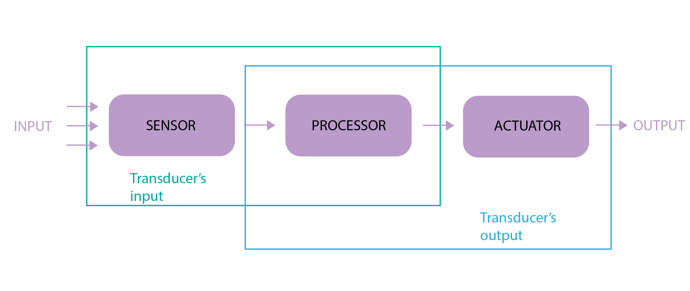

Sensors are a fundamental part of IoT. In this course, we will learn how to wire and program them. We will use several sensors as examples, such as DHT11, GPS, Soil moisture or Motion sensor.

Introduction
========
Generally, sensors are used in the architecture of IOT devices. Sensors are used for sensing things and devices etc.

A device that provides a usable output in response to a specified measurement.The sensor attains a physical parameter and converts it into a signal suitable for processing (e.g. electrical, mechanical, optical) the characteristics of any device or material to detect the presence of a particular physical quantity. The output of the sensor is a signal which is converted to a human-readable form like changes in characteristics, changes in resistance, capacitance, impedance, etc. In various systems the transducer might be used as an actuator. The transducer helps to convert a signal from one physical structure to another or one type of energy into another type.

There are different types of sensor available. They can be classified as -
- Temperature Sensors
- Humidity Sensors
- Advanced T/H Sensors
- Distance Sensors
- Motion Sensors
- Sound Level Sensors
- Light Sensors
- RFID Tags
- GPS & Localization
- OLED Screen
  

Sensors
=======

