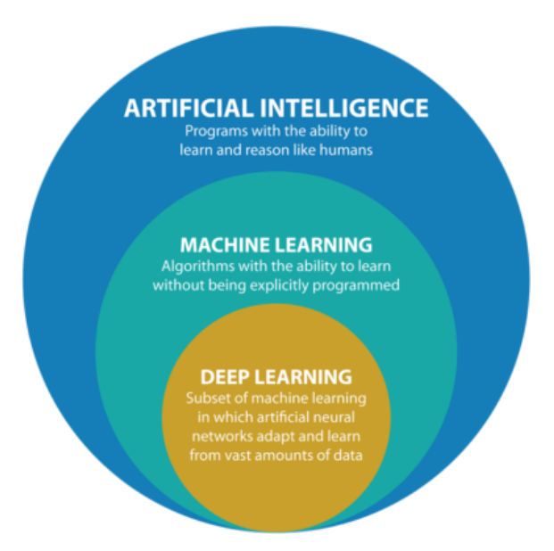

In this lesson, we'll learn the basics about Artificial Intelligence (AI).



# General Introduction

When people think of AI, most of them think of **Artificial General Intelligence** (AGI). An AGI can do everything what humans do (and even better). But the sad truth is, that mankind is not even close to develop a "real AGI".
Nowadays AI is very focused to a specific use case, therefore one can speak of a **Artificial Narrow Intelligence** (ANI). Because you train it on a specific thing its capabilities are limited. If you try to use it for another task, it will not perform like you would expect it to perform.

**In this tutorial we will concentrate on ANI.**

AI is separated in many subfields, in the following we will elaborate on some of them.

- Machine Learning (ML)
- Deep Leaning (DL)
- Computer Vision (CV)
- Natural Language Processing (NLP)

How the fields overlap and are interlinked is conveyed in the following visualization.

How the AI disciplines are connected and interlinked to each other [Con21]. 

Artificial Intelligence is the most general scientific field. One subfield of Artificial Intelligence is Machine Learning. It describes algorithms with a ability to learn a task, without being explicitly programmed to do so. A subfield of Machine Learning is Deep Learning. Computer Vision and for example the late development in Natural Language Processing are part of Deep Learning. Deep Learning can be understood as a subset of Machine Learning, here with help of e.g. convolutional neural networks is being possible to learn and process great amounts of data.

# Sources

[Con17] Prof. Congduc Pham, WAZIUP Online Course: Fundamentals of Artificial Intelligence, https://cpham.perso.univ-pau.fr/LORA/HUBIQUITOUS/solution-lab/arduino-lora-tutorial/iot-courses/F-AI-1_Introduction.pdf, Version 2017