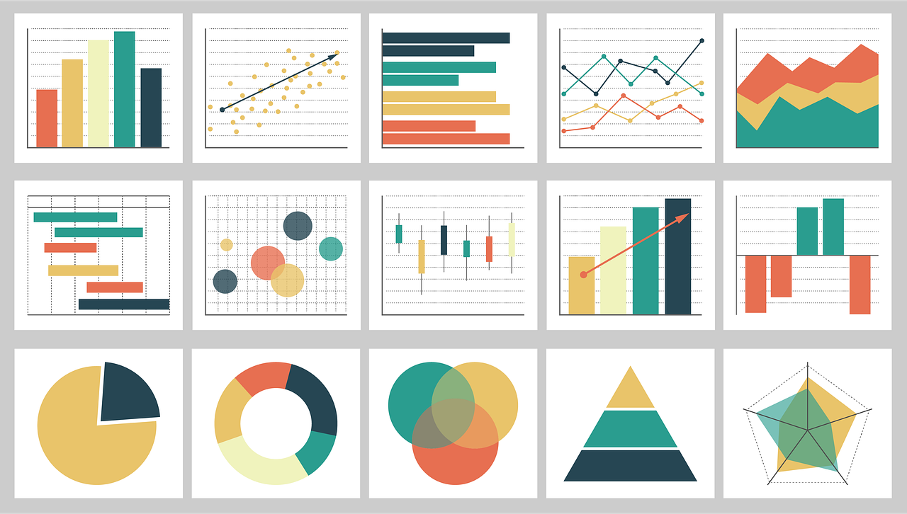

Course under construction.

This course will cover the various IoT data visualization techniques (DataViz). The objective of data visualization is to extract relevant information from massive amounts of data. We will use various existing platforms, such as Grafana, Kibana and Tableau.

# Data Visualization Introduction

The visualization of data is a graphical representation of information. With utilizing visual elements like charts, maps and graphs, one can understand the data an judge on patterns, tendencies or exceptions.

Example picture of some visualization types [Wall21]. 

It is part art science and part art. The objective is to get the science part and the art part right. There are many visualizations that only get part of it right. Information needs to presented in a way, that it allows the observer to retrieve it effortless. On the other hand, aesthetics are also important. A good visualization should be also pleasing to look at.  

## Importance of DataViz

DataViz is an effective way to share complex information that is difficult to convey in words. Charts, graphs and photos transport information more quickly than large tables that are hard to retrieve relevant information from or written text that needs more time to read. Visualized metaphors can be understood by people of any language. Visual data increases knowledge and is easy to process, analyzed and remembered. It is also easier to consume information that way. 

## Principles

In the following the characteristics of effective graphical displays is conveyed. These are being:

- display the data
- induce the viewer to consider the substance rather than methodology, graphic design, graphic production technology, or something else
- try not to distort what the data has to say.
- display a large number in a small space
- make large data sets logical
- encourage the eye to compare various types of data
- reveal the data at various levels of detail, from a high-level overview to the fine structure
- serve a clear purpose, such as description, exploration, tabulation, or decoration
- be closely integrated with a data set's statistical and verbal descriptions

# Grafana

# Kibana

# Tableau

# Sources

[Wall21] Wallusy: charts, tables, graph, statistics https://pixabay.com/illustrations/charts-tables-graph-statistics-6246450/
