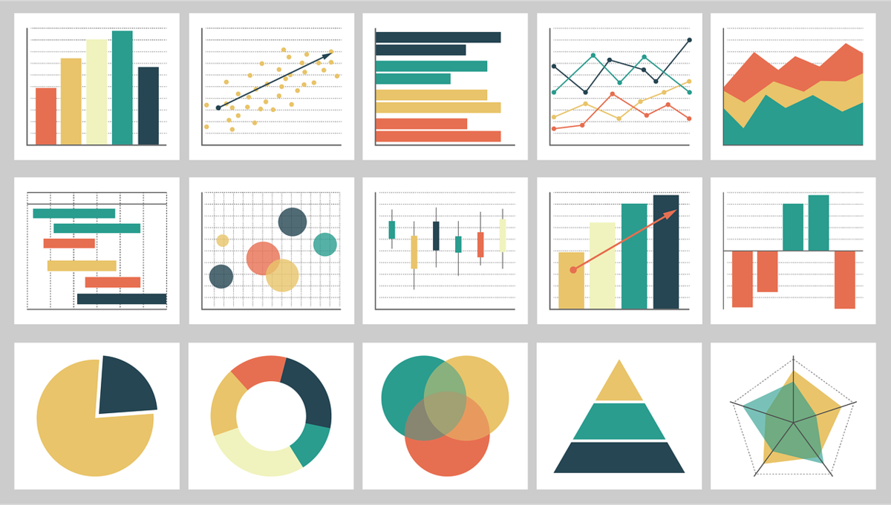
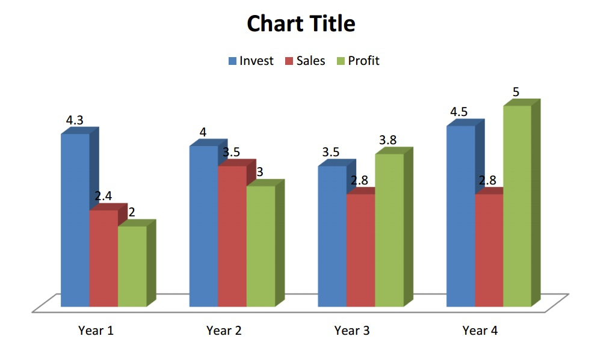

Course under construction.

This course will cover the various IoT data visualization techniques (DataViz). The objective of data visualization is to extract relevant information from massive amounts of data. We will use various existing platforms, such as Grafana, Kibana and Tableau.

# Data Visualization Introduction

The visualization of data is a graphical representation of information. With utilizing visual elements like charts, maps and graphs, one can understand the data an judge on patterns, tendencies or exceptions.

Example picture of some visualization types [Wall21]. 

It is part art science and part art. The objective is to get the science part and the art part right. There are many visualizations that only get part of it right. Information needs to presented in a way, that it allows the observer to retrieve it effortless. On the other hand, aesthetics are also important. A good visualization should be also pleasing to look at.  

## Importance of DataViz

DataViz is an effective way to share complex information that is difficult to convey in words. Charts, graphs and photos transport information more quickly than large tables that are hard to retrieve relevant information from or written text that needs more time to read. Visualized metaphors can be understood by people of any language. Visual data increases knowledge and is easy to process, analyzed and remembered. It is also easier to consume information that way. 

## Principles

In the following the characteristics of effective graphical displays is conveyed. These are being:

- display the data
- induce the viewer to consider the substance rather than methodology, graphic design, graphic production technology, or something else
- try not to distort what the data has to say.
- display a large number in a small space
- make large data sets logical
- encourage the eye to compare various types of data
- reveal the data at various levels of detail, from a high-level overview to the fine structure
- serve a clear purpose, such as description, exploration, tabulation, or decoration
- be closely integrated with a data set's statistical and verbal descriptions

## Different types of Data Visualizations

**Pie Chart:** A pie chart is used to show the proportion of a whole. It is represented in a circular format and the proportion of each section is indicated by the size of the slices. 

**Bar Chart:** A bar chart is a graphical representation of data in which data points are displayed in the form of bars. It is used to compare values across different categories. An example can be found below.

**Histogram:** A histogram is a chart that shows the distribution of a numerical variable. It is a graphical representation of the frequency of occurrence of different ranges of values. 

**Gantt Chart:** A Gantt chart is a graphical representation of a project timeline. It is used to visualize the progress of a project and plan tasks in order to meet deadlines.

**Heat Map:** A heat map is a graphical representation of data where values are represented by colors. It is used to visualize the distribution of data and identify patterns.

**Box and Whisker Plot:** A box and whisker plot is a graphical representation of data where the data points are displayed in the form of a box. It is used to identify the spread of data and identify outliers.

**Waterfall Chart:** A waterfall chart is a graphical representation of data in which data points are displayed in the form of columns. It is used to show changes in a data set over time.

**Area Chart:** An area chart is a graphical representation of data in which data points are displayed in the form of a graph. It is used to show the relationship between two or more variables.

**Scatter Plot:** A scatter plot is a graphical representation of data in which data points are displayed in the form of a graph. It is used to show the relationship between two or more variables.

**Pictogram Chart:** A pictogram chart is a graphical representation of data in which data points are displayed in the form of pictures. It is used to make data easier to understand and visualize relationships.

**Timeline:** A timeline is a graphical representation of data in which data points are displayed in the form of a chronological list. It is used to show changes over time.

**Highlight Table:** A highlight table is a graphical representation of data in which data points are displayed in the form of a table. It is used to compare and contrast different sets of data.

**Bullet Graph:** A bullet graph is a graphical representation of data in which data points are displayed in the form of a bar graph with a single point of reference. It is used to compare data points and identify performance levels. 

**Choropleth Map:** A choropleth map is a graphical representation of data in which data points are displayed in the form of colored regions. It is used to show how data is distributed across geographic regions.

**Word Cloud:** A word cloud is a graphical representation of data in which data points are displayed in the form of words. It is used to identify the most common words in a text and show the frequency of occurrence.

**Network Diagram:** A network diagram is a graphical representation of data in which data points are displayed in the form of a network. It is used to visualize relationships between different entities.

**Correlation Matrices:** Correlation matrices are graphical representations of data in which data points are displayed in the form of matrices. It is used to identify relationships between different variables.

# Grafana

# Kibana

# Tableau

# Sources

[Wall21] Wallusy: charts, tables, graph, statistics https://pixabay.com/illustrations/charts-tables-graph-statistics-6246450/

[Bar16] Frank dbt: Bar graph - stock price statistics https://commons.wikimedia.org/wiki/File:Bar_graph_-_stock_price_statistics.jpg
