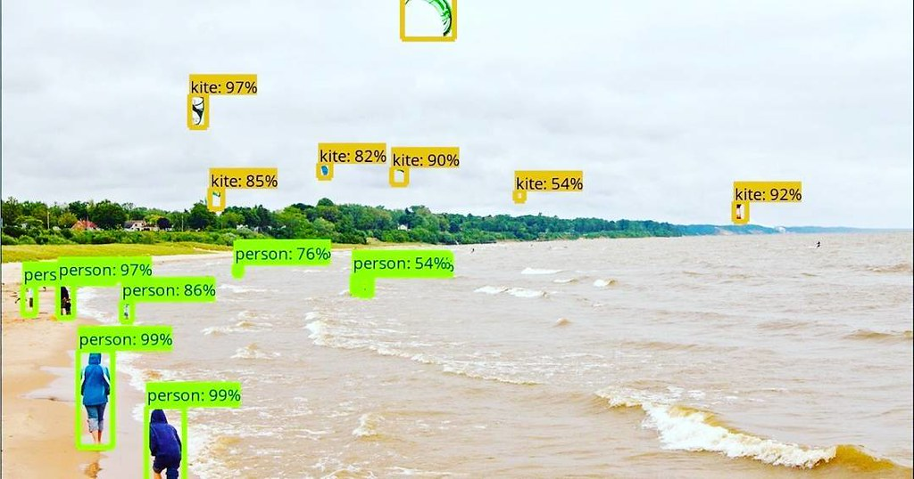

In this lesson, we'll learn the basics about Computer Vision (CV).

# Introduction

This section introduces the basic techniques of image-based recognition. Under the computer-aided recognition of images, or Computer Vision, one understands various techniques to locate elements in images or identify and catalog videos. 

Example picture of object detection [Rath17]. 

The goal is to use an automated process to gain a visual understanding while distinguishing between relevant and less distinguish relevant information. This is a complex process that otherwise reserved only for the human visual system, part of the nervous system.

Computer Vision is a subfield of Deep Learning, which is a subfield of Machine Learning, Machine Learning on the other hand belongs to Artificial Intelligence. 

Computer Vision can be also conducted without Deep Learning models. Like to detect edges or select objects from an image. But nowadays it is common that Computer Vision algorithms mainly use Deep Learning models. 

# Applications

Here are some examples of the most common applications of CV:

- image labeling
- face recognition
- object detection
- image classification
- object tracking
- defect detection
- movement analysis
- cell classification

# Different recognition types 

Today it is common to train image recognition models, which take an image as a received input and output one or more objects and possibly more recognize attributes. The various objects possible to recognize are in classes assigned. Examples of these images must first be stored in so-called image databases collected. In addition to the class prediction these image recognition models also provide an assessment of the accuracy of the prediction meet. This value can be understood as a kind of probability of prediction and describes how confident the model is that an image becomes a learned class can be assigned.

In general, the recognition systems distinguish between single and multiple recognition. With a single detection, the model says only one class as Prediction for the entire image. Models designed for multiple detection were able to recognize several objects of different classes in one image.
Consequently, information on the localization of the object in the image and confidence needed.

In the [next course, we have a topic dedicated to Computer Vision](../3.ComputerVision/1.GeneralIntroductionCV.md), we have a more in dept view, into the details of CV. 

## Sources

[Rath17] Huang J, Rathod V, Sun C, Zhu M, Korattikara A, Fathi A, Fischer I, Wojna Z, Song Y, Guadarrama S, Murphy K, "Speed/accuracy trade-offs for modern convolutional object detectors." https://github.com/tensorflow/models/tree/master/research/object_detection Version: CVPR 2017