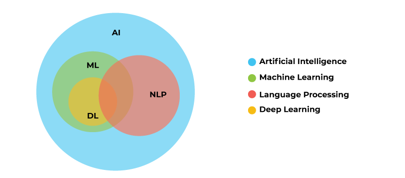

In this lesson, we'll learn the basics about Natural Language Processing (NLP).

# Introduction

Natural Language Processing (NLP) examines how natural language in the form of text or spoken language data can be processed algorithmically with the help of computers. It is a subfield of Artificial Intelligence and shares some techniques with Machine Learning and also the subfield Deep Learning. This relationship is illustrated in the following schematic:

How is Natural Language Processing interlinked with Artificial Intelligence, Machine Learning and Deep Learning [Bala21].

It is the interface between linguistics and computer science. The goal of NLP is the capability of understanding the contents of documents and accurately extract information and insights contained in the documents as well as categorize and organize the documents themselves. 

## Goals in NLP

The common goals or challenges of natural language processing are discussed in the following:
 - speech recognition
 - natural language understanding
   - Segmentation of previously captured speech into single words and phrases
   - Recognizing the basic forms of words and acquiring grammatical information
   - Recognizing the functions of individual words in the sentence (subject, verb, object, article, etc.)
   - Extraction of the meaning of sentences and parts of sentences
   - Recognizing sentence contexts and sentence relationships
 - natural language generation

 ## Applications for NLP

 In the following there are some applications of NLP named and shortly explained.

- **Speech recognition**: recognize spoken words
- **Chatbots**: provide automated answers to frequently asked customer questions, rather simple, canned answers
- **Question-Answer Systems**: like chatbots, but more sophisticated, with good language understanding 
- **Translation**: translate spoken and written text to another language
- **Sentiment Analysis**: interpret and analyze emotions in text, like articles or politician speeches
- **Automatic text summarization**: summarizes a long article or text to a shorter version
- **Grammar checking**: correcting grammatical errors in a text
- **Text classification**: assigning tags to articles to according to content and semantics
- **Named Entity Recognition**: like text classification and similar to sentiment analysis, tries to understand content of named entity: 
  - Example: *Elon Musk* [person] founder of *Tesla* [company] is buying *Twitter* [company] for *$44 billion* [monetary value].

## 

 ## Sources

 [Bala21] Ximena Bolaños, Natural Language Processing and Machine Learning, https://www.encora.com/insights/natural-language-processing-and-machine-learning, Version: September 29, 2021