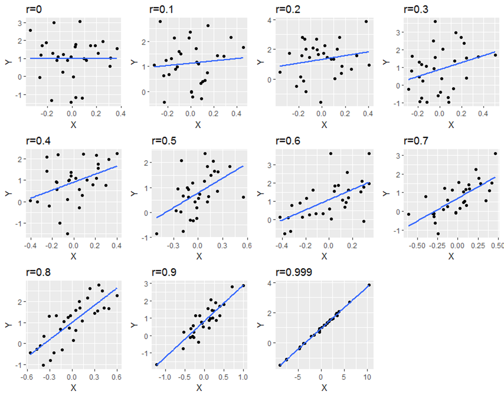

In this lesson, we'll learn the basics about regression analysis.

# Regression Analysis

## General Introduction to Regression Analysis

Regression analysis is a basic concept of machine learning. With help of regression continuos values can be predicted. It is used to plot a best-fit line or a curve between data and can give a hint about the future development of data. It is a supervised learning method, that means the model is trained with help of training data and labels.

## Popular Regression Algorithms

Regression algorithms are trying to map an association between variables. Models are refined by the measurement of errors in predictions that are made by a model.

Regression methods are originated from the scientific field of statistics and had been adopted to statistical machine learning.

- Ordinary Least Squares Regression (OLSR)
- Linear Regression
- Logistic Regression
- Stepwise Regression
- Multivariate Adaptive Regression Splines (MARS)
- Locally Estimated Scatterplot Smoothing (LOESS)

## Variables

In regression analysis a set of statistical methods is used to estimate relationships between a dependent and one or more independent variables.

- dependent variables: variable which holds the phenomena which we are studying, is dependent on other variables or factors, changes when independent variables change
- independent variables: the variables that are not affected by other variables

### Example on dependent and independent variables

Let's create a dataset that as some independent variables.

!!! TODO: needs to be moved into another topic.

## Important Metrics

In the following the important metrics like variance, bias, r2-score and mean square error (MSE) are explained. Machine learning algorithms use statistical or mathematical models. They have inherent errors in two categories:

- irreducible errors: inherent uncertainty, due to noise in training data due to unknown variables
- reducible errors: more controllable, should be minimized to ensure higher accuracy: variance and Bias

So the error in a machine learning model is made up of:

The reducible Error is the sum of squared Bias and Variance.

Combining the above two equations, we get:

### Variance

!!! TODO: make difference between BIAS clear

Also known as **Variance Error** or **Error due to Variance**. Variance measures how close observed values are to predicted values or, in other words, how far observed values are spread out from the their mean (predicted) values. The goal is here to have a low value, this means the prediction is accurate compared to the observed values. 
It shows the amount of the target's functions change, if different training data is introduced.

### Bias

Bias is a constant or vector that shows the difference of the model's prediction from the target value. In other words, it is the simplifying assumption made by the model to make the target function easier to approximate. The difference of Bias and Variance is illustrated in the diagram below.

Difference between variance and bias illustrated [Fort12]. 

### Correlation

Explains relationship between two variables, it shows how they are related to each other. Possible values can be from *-1* to *+1*. 

- A correlation of *-1* represents a perfect negative correlation.
- A correlation of *0* tells that the values are not linked at all.
- A correlation of *1* means that there is a perfect positive correlation.

In the following diagrams the correlation is visualized for different datasets. 

The blue line shows the predicted linear regression function, the black points represents the actual datapoints. The correlation is stated above the diagram [Curl20].

Only positive correlation is shown, for negative correlation the slope of the prediction would be negative.

### R2-Score

The r2 score closely relates to Mean Square Error (explained in the next bulletin). It is a percentage, that varies from *0* % - *100* %. The r2 score shows a ratio of variances:

A high value means that the variables are perfectly correlated, there is no variance. A low value would indicate a low level of correlation, that means in most cases, that the model is not suitable for the given task.

A more in-depth mathematical explanation of the r2 score is given by Paul Johnson in his lecture ["Extending R-squared beyond ordinary least-squares linear regression"](https://www.slideshare.net/pcdjohnson/extending-rsquared-beyond-ordinary-leastsquares-linear-regression-95949488)

### Mean Square Error

The metric Mean Square Error (MSE) describes the average of the square errors, the larger the number of MSE is, the larger the error. The metric is defined as the following:

The diagram below shows a graph that was created using linear regression. 

The blue line shows the predicted linear regression function, the purple points are the actual datapoints, the red lines represents the error (residuals) which is squared [Bini18].

Now the distance from our calculated line is squared and added up and multiplied by the reciprocal amount of points, this gives an average deviation to our prediction.

A more in-depth mathematical explanation of the r2 score is given by Moshe Binieli in his article ["Machine learning: an introduction to mean squared error and regression lines"](https://www.freecodecamp.org/news/machine-learning-mean-squared-error-regression-line-c7dde9a26b93/)

## Sources

[Fort12] Scott Fortmann-Roe: Understanding the Bias-Variance Tradeoff http://scott.fortmann-roe.com/docs/BiasVariance.html June 2012

[Curl20] James P. Curley & Tyler M. Milewski: "PSY317L Guidebook: 11 Correlation" https://bookdown.org/curleyjp0/psy317l_guides5/correlation.html Version: 2020 

[Bini18] Moshe Binieli, "Machine learning: an introduction to mean squared error and regression lines" https://www.freecodecamp.org/news/machine-learning-mean-squared-error-regression-line-c7dde9a26b93/ Version: 2022

