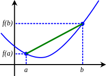
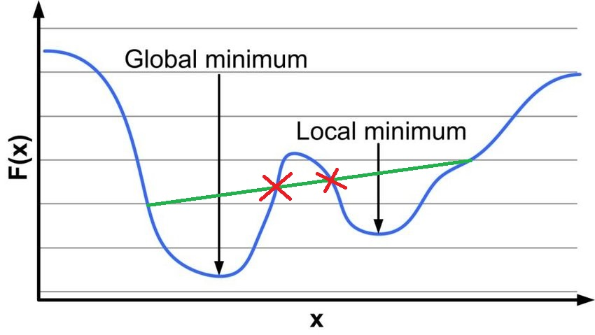
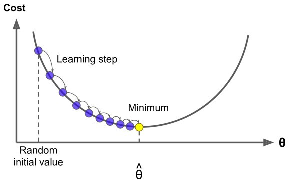

In this lesson, we'll learn the basics about linear regression analysis.

# Linear Regression

## Introduction

Linear Regression is a supervised learning algorithm. It aims to create a relation between the dependent variable (*y*) and one or more independent variable (*x*). In other words “Linear Regression” is a method to predict dependent variable (Y) based on 

!!! TODO: Check multiple ones?

values of a independent variable or variables (X). For a simple linear regression there can be only one independent variable.

This is accomplished by a linear function, which is created with help of metrics like "ordinary least square" (*OLS*) or "mean squared error" (*MSE*).

!!! Change

When there is a single continuous dependent variable and a single independent variable, the analysis is called a simple linear regression analysis . 
!!! Change

## Ordinary Least Squares

Ordinary Least Squares (OLS) is a type of linear least squares for guessing the not known parameters in linear regression models. It is an extended form of the basic linear function *y = f(x) = mx + n*, the extension is the error component ε.
It is done with help of the equation below:

- Y  : Represents the target, dependent variable
- X  : Represents the features, independent variables
- β0 : Intercept value: value of y at intersection with y-axis (x=0)
- β1 : Slope of the line that minimizes the sum of squared errors
- ε  : Random error component: for effects outside the model, which alter it

!!! TODO: missing explanation 

## Gradient Descent 

Gradient descent is a continuos first-order optimization algorithm, used to find the local maximum/minimum of a function. The gradient describes the slope of a function at a given point. In case of a univariate function, it is the first derivative at a point. For a multivariate function, it is a vector of derivatives.

### Requirements

The gradient decent algorithm does not work for every function, it has specific requirements:

- The function needs to be **differentiable**
- The function needs to has a **convex shape**

Differentiable functions have a derivative for each point in the course of the function. Non differentiable functions have a discontinuity, a step or a cusp.

For Convex functions one could have a line segment on connecting two arbitrary points of a function without crossing it. Some examples are shown below:

A convex shaped function, the green line cannot intersect with function [Ful13]. 

If the line segment crosses the course of the function in one or more points, it is a non-convex function.

A non-convex shaped function, the green line can intersect with function [Jes15]. 

### Algorithm

The gradient descent algorithm calculates the next point using gradient at the current position, the size of the steps are scaled by the learning rate (η) and subtracts the given value from the current point. Since the we want to minimize the function, we have to subtract the value, to find the maximum one would need to add. This can be expressed with the following equation:

The parameter η (eta) scales the gradient and likewise regulate the step size. It is called learning rate. This parameter has a big influence on the amount of steps, that have to be observed to find the minimum of the function.

Gradient decent search determines a weight vector (w) that minimizes error (E). The first step is to take a random starting point to evaluate the minimum of a function, that means a arbitrary initial weight vector is being chosen. On every observed point, the sum of squared errors are calculated. The learning rate is used to scale the coefficients. This process is repeated until there is no improvement visible, so the minimum of sum of squared error is reached. This process is visualized in the diagram below:

Shows the process of the approximation with help of gradient descent algorithm [Gud21]. 

Convergence is normally reached slowly, since the optimization steps, controlled by learning rate, are small. In the following different learning rates and their influence are being compared.

Shows different learning rates, in the left the learning rate is to small, the middle shows a optimal learning rate, the right a big learning rate leads to divergent behavior [Jor18]. 

## Regularization

There are also extensions of the training methods, applied to linear models, called regularization methods. Regularization is aiming to minimize the sum of squared error of the model on the training data (using OLS) and also reduce the complexity of the model. This is done absolute size of the sum of all coefficients in the model.

So in course of the training process of machine learning model, one important aspect is to avoid overfitting. This is happening because your model learns all the noisy features of your dataset. Noisy data points do not represent the properties of your data. By leaning those points, your model gets more flexible but is also prone to overfitting.

In the [previous module](1.RegressionBasics.md) we learned the difference between bias and variance, these concepts are important to understand the phenomena of overfitting.

Regularization is a form of regression, it constraints, regularizes or shrinks the used coefficients near to zero. 

There are two commonly used regularization methods for linear models:

- **Lasso** Regression: OLS is modified to minimize the **absolute sum of coefficients** (also called **L1** regularization)

- **Ridge** Regression: OLS is modified to minimize the **squared absolute sum of coefficients** (also called **L2** regularization)

The methods explained before are adequate to use if there is a collinearity  occurring in your input values and OLS algorithm would overfit the training data.

## Preparation of Dataset for Linear Regression

The requirements and expectations to your data when you create a linear regression model, some of them are named and explained here.

### Noise reduction

It may be necessary to remove noise from your data, to let you clarify and expose the signal in your dataset. 

### Linear course of function

With linear regression the relationship between input and output data is assumed to be linear. If the course of the function is quadratic or at least different, another regression method has to be chosen. 

### Gaussian Distributions

If you have a Gaussian distribution in your input and output variables, linear regression will make more reliable predictions.

### Rescale Inputs

Rescaling the input variables with standardization or normalization will also make your model more robust and reliable.

### Remove Collinearity

If you have a high correlation in your input variables, linear regression is prone to over-fit your data. It should be considered to calculate pairwise correlations in your input data

## Use Linear Regression to make predictions

Making a prediction after calculated the linear equation is quite simple, you just have to solve the function for a specific input.

!!! TODO: finish

## Sources

[Ful13] Fulvio314, Convex function, https://commons.wikimedia.org/wiki/File:Convex_function_2.svg 8 July 2013

[Jes15] Christensen Jesper, Topology Optimisation of Structures Exposed to Large (non-linear) Deformations, 10.13140/RG.2.1.1212.8724, 2015

[Gud21] Varshitha Gudimalla, Concept of Gradient Descent in Machine Learning, https://varshithagudimalla.medium.com/concept-of-gradient-descent-algorithm-in-machine-learning-44f587ac16ac, 2021

[Jor18] Jeremy Jordan, Setting the learning rate of your neural network,
https://www.jeremyjordan.me/nn-learning-rate/, 2018