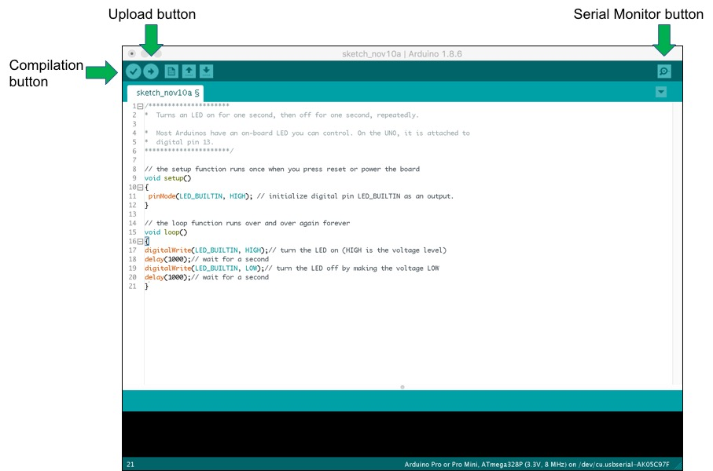
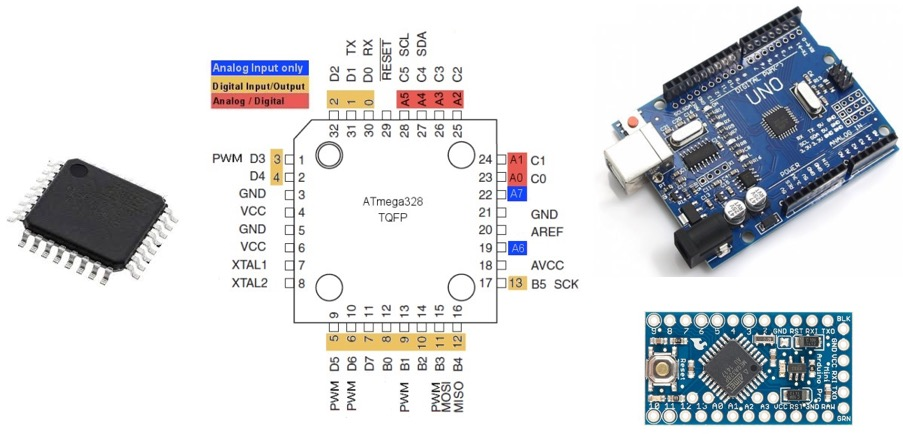

This course will show you how to program your Arduino. First of all, we will install the Arduino IDE, and configure it.
We’ll then learn the basics of programming in Arduino C: the syntax, variables, keywords, control structures, operators, functions...
We’ll then test our knowledge with simple examples.

Introduction
=============

The Arduino IDE (Integrated Development Environment) is used to write the computer code and upload this code to the physical board.
The Arduino IDE is very simple and this simplicity is probably one of the main reason Arduino became so popular.
We can certainly state that being compatible with the Arduino IDE is now one of the main requirements for a new microcontroller board.
Over the years, many useful features have been added to the Arduino IDE and you can now managed third-party libraries and boards from the IDE, and still keep the simplicity of programming the board.
The main window of the Arduino IDE is shown below, with the simple simple Blink example.




You can get different versions of Arduino IDE from the [Download page](https://www.arduino.cc/en/Main/Software) on the Arduino Official website.
You must select your software, which is compatible with your operating system (Windows, IOS, or Linux).
After your file download is complete, unzip the file to install the Arduino IDE.

Setup
=====

After connecting your board with a USB able, you must select the correct Arduino board name, which matches with the board.
Go to Tools → Board and select your board.
For most of example illustrations, we are using an Arduino Uno board, but you must select the name, and sometime also the version, matching the board that you are using: Arduino Nano, Arduino Pro Mini 3.3v and 8MHz,...

## Select your serial port

Go to Tools → Port menu.
This is likely `/dev/ttyUSB0` on Linux machine, or `/dev/cu.usbserialXXXXX` on MacOs computers or `COM3` or higher (COM1 and COM2 are usually reserved for hardware serial ports) on Windows computers.
 
To find out, you can disconnect your Arduino board and re-open the menu, the entry that disappears should be of the Arduino board. Reconnect the board and select that serial port.

Your first Arduino project
==========================

Once the software starts, you have two options: you can create a new project or you can open an existing project example.
To create a new project, select File → New. And then edit the file.
To open an existing project example, select File → Example → Basics → (select the example from the list).
For explanation, we will take one of the simplest of examples named `AnalogReadSerial`. It reads a value from analog pin A0 and print it.

```c++
// the setup routine runs once when you press reset: 
void setup() 
{
  // initialize serial communication at 9600 bits per second:
Serial.begin(9600);
}

// the loop routine runs over and over again forever: 
void loop()
{
  // read the input on analog pin 0:
  int sensorValue = analogRead(A0);
  // print out the value you read:
  Serial.println(sensorValue);
  delay(1);  // delay in between reads for stability
}
```

Upload the program
==================

Simply click the `Upload` button in the Arduino IDE window. Wait a few seconds, you will see the RX and TX LEDs on the board flashing. If the upload is successful, the message **Done uploading** will appear in the status bar.

If you have issue uploading your sketch, such as **out-of-sync** message or **programmer not responding** message, check your board type and also avoid connecting the board to your computer with a too long USB cable. Also avoid connecting through a USB hub. 

## Output

You can click on the `Serial Monitor` button to open the serial monitor in order to show the output from the Arduino board (whatever is written with the `Serial.print()` function.

Be sure to select at the bottom of the Serial Monitor window, the baud rate corresponding to what has been set in your program (in the example here it is 9600).

As there is nothing connected to analog pin A0, the value read can be random. However, you can see the display. The principle of the `analogRead()` function is simple: if your board is a 3.3V board, then a value of 1023 means 3.3V (maximum) and 0 means 0V (minimum). Values in-between have linear relationship with regards to the maximum voltage value. The maximum value of 1023 comes from the fact that most Arduino board have a 10-bit analog-digital converter.  
                
```
245
246
276
456
345
567
...
```

Basic programming
=================

**Sketch** − The first new terminology is the Arduino program called `sketch`.
Arduino programs can be divided in three main parts: Structure, Values (variables and constants), and Functions.
Let us start with the structure which consists of two main functions:

### Setup() function

The `setup()` function is called when a sketch starts. It is used to initialize the variables, pin modes, start using libraries, etc. 
The setup function will only run once, after each power up or reset of the Arduino board. Here, you can see the `Serial.begin(9600);` statement which opens the serial port to allow the board to send output for display by the serial monitor (see "Output" sub-section below).

### Loop() function

After calling the `setup()` function, which initializes and sets the initial values, the `loop()` function does precisely what its name suggests, 
and loops consecutively, allowing your program to change and respond. It is used to actively control the Arduino board. Here, you can see how a value is read from an analog pin (see "Understanding microcontroller pins" sub-section below), then displayed with the `Serial.println(sensorValue);` statement.
               		
Most of the information on this page is taken from [here](https://www.tutorialspoint.com/arduino/index.htm). There are other tutorials which one might find interesting for understanding the electronics and programming an arduino board like the one here on [Sparkfun](https://learn.sparkfun.com/tutorials/what-is-an-arduino/all).

Microcontroller pins
====================

Microcontrollers usually have analog and digital pins that can be easily controlled.
Reading from a physical sensor is generally realized through an input while control or actuation is generally realized through an output.
An analog and a digital pin is internally attached to a analog-digital converter (ADC) which provides the feature of converting a range on voltage, e.g. 0-3.3V, into a range of numerical values, e.g. 0-1023.
A digital pin can generally only have a LOW level (0V for instance) and a HIGH level (3.3V for instance).

In the figure below is illustrated the popular ATmega328P 8-bit microcontroller that is used to equip the Arduino Uno, Nano and ProMini boards. You can see, from left to right, the real chip, then the schematic with the pin layout, and finally the Arduino Uno and ProMini boards that expose the microcontroller pins on header pins.



If you have an analog physical sensor such as an [analog LM35DZ](/resources/waziup/analog-temperature-sensor) temperature sensor, then you need to connect it to an analog pin. If you have a digital sensor, it means that the sensed value is not represented by a linear function of the voltage, but with an appropriate digital coding of the value. Depending on the coding, you have to drive (e.g. read) the digital pin accordingly in order to determine the numerical value. But, usually, this is done through already written sensor or communication libraries such as the `OneWire` library for digital sensors using the OneWire format. A digital sensor can be connected to an analog pin if only LOW and HIGH level are used. However, it is a safe habit to use a digital pin for digital sensors, unless specified differently by the sensor or communication library.

For a [digital DHT22](/resources/waziup/dht22-temperature-humidity-sensor) sensor, those who want to go into more details, you can look at the [DHT.cpp](/src/sketch/libraries/DHT-sensor-library/DHT.cpp) file to see how the DHT22 read function is implemented. Of course, one needs to get the reference datasheet of the DHT22 sensor provided by the manufacturer in order to implement these kind of codes.


Arduino programming
===================

If you are a seasoned C/C++ programmer, the first thing that you will note when opening an Arduino sketch is that...
It has no "main" function! 
The Arduino library replaces it with two functions, that you already know: `setup()` and `loop()`.
There is actually a main, but it is hidden.

The Arduino developers also removed a lot of instructions from the C++ language, for the sake of gaining memory space.
It also have a handful of new commands.


Arduino Specific Functions
---------------------------

Here are the most important functions:
```c++
pinMode(pin, mode)
```
This function configures a digital pin to read (input) or write (output) a digital value

```c++
digitalWrite(pin, value)
```
digitalWrite writes the digital value (HIGH or LOW) to a pin set for output

```c++
digitalRead(pin)
```
Reads a digital value (HIGH or LOW) on a pin set for input

There is also the analog versions of the above: `analogRead` and `analogWrite`.
`analogRead` read the tension provided on a pin, and returns a value between 0 and 1023 (for Arduino Uno).

To write to the Serial monitor, you can use `print` and `println`.

```c++
Serial.println(string)
```


`delay` is also very useful:
```c++
delay(int)
```

To study Arduino programming more in depth, you can head to [this course](https://startingelectronics.org/software/arduino/learn-to-program-course/).
