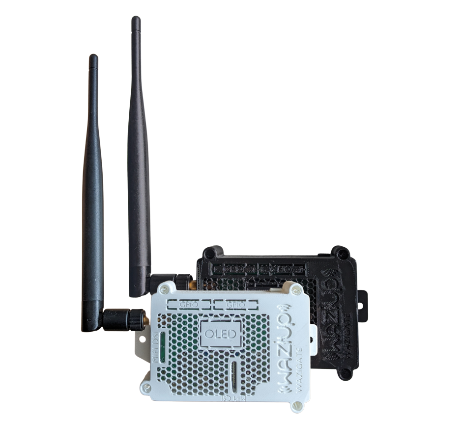

Introduction
============

WaziGate is an IoT LoRaWAN Gateway, ideal for all your remote IoT applications. The Gateway can cover up to 100 IoT Sensors and actuator nodes: Weather stations, soil monitoring, GPS applications. The possibilities are endless! You can host your own applications directly in the gateway. The WaziGate features:
- Edge capacity to host your applications
- LoRa communication up to 10-12 Km
- Wifi/3G/Ethernet internet connection
- Automation & remote management
- Low power consumption

# Specification

The waziup gateway is essentially a raspberry pi with a Lora wazihat, antenna and power supply. Therefore it assumes the specification of the Raspberry pi model used. Below are the specs of the Pi 4 since it is the version commonly used for wazi-gateway these days.

- Broadcom BCM2711, Quad core Cortex-A72 (ARM v8) 64-bit SoC @ 1.5GHz
- 1GB, 2GB, 4GB or 8GB LPDDR4-3200 SDRAM (depending on model)
- 2.4 GHz and 5.0 GHz IEEE 802.11ac wireless, Bluetooth 5.0, BLE
- Gigabit Ethernet
- 2 USB 3.0 ports; 2 USB 2.0 ports.
- Raspberry Pi standard 40 pin GPIO header (fully backwards compatible with previous boards)
- 2 × micro-HDMI ports (up to 4kp60 supported)
- 2-lane MIPI DSI display port
- 2-lane MIPI CSI camera port
- 4-pole stereo audio and composite video port
- H.265 (4kp60 decode), H264 (1080p60 decode, 1080p30 encode)
- OpenGL ES 3.1, Vulkan 1.0
- Micro-SD card slot for loading operating system and data storage
- 5V DC via USB-C connector (minimum 3A*)
- 5V DC via GPIO header (minimum 3A*)
- Power over Ethernet (PoE) enabled (requires separate PoE HAT)
- Operating temperature: 0 – 50 degrees C ambient

# Features

- Edge capacity to host your applications
- LoRa communication up to 10-12 Km
- Permanent Wifi hotspot
- Wifi/3G/Ethernet internet connection
- Data upload with HTTP, MQTT or even SMS
- Low power consumption
- Automation
- Remote management
