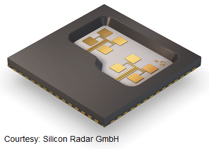
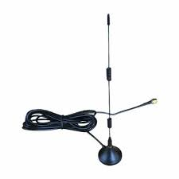
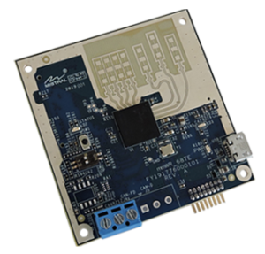

# Introduction

In particular, applications where wired connectivity is nearly impossible to offer, largely depend on wireless connectivity to communicate with IoT gateways and other devices in the ecosystem. A variety of antennas that support different kinds of networks make this communication possible. Internet of Things (IoT) systems have significantly changed over the last ten years, becoming smaller and incorporating more sophisticated wireless technology. The growth of antenna technology and IoT antenna design has been greatly influenced by these advancements, resulting in the creation of ultra-compact antennas with exceptional efficiency and performance. Multiple antenna integration has become a standard need for high-performance, tiny form-factor Internet of Things designs, presenting significant challenges to IoT device makers.

# Antennas for IoT applications
The numerous types of IoT antennas that are frequently employed in IoT devices are explained in brief in this section.

## Chip Antennas
Chip antennas have a limited bandwidth and are tiny in size. Larger ground planes help them function better, which could make integrating a board with a high component density more difficult. Due to their short range, chip antennas are the best option for small IoT devices like Computers, GPS devices, satellite radios, and others that employ low-frequency bands.

## Wire Antennas
In comparison to other IoT antennas like Chip and Whip, wire antennas are more cost-effective. Antenna size grows as frequency decreases since wire antenna size is inversely related to frequency, which can present design issues. Wire antennas provide good radio frequency performance and can be mounted to the PCB over a ground plane or linked via coaxial cable. They come in a variety of patterns and shapes, including dipole, loop, and helix. These antennas are widely utilized in connected automobiles, smart building solutions, and other applications.

## Whip Antennas

Among the most expensive of the often used antennas, whip antennas are among the best-performing IoT antennas. They physically connect to the PCB via a coaxial connector and are often placed outside the device container. A popular kind of monopole antenna that works well for wireless communication in ISM, LoRa, and LPWAN-based applications is the whip antenna. Whip antennas are perfect for designs that make use of several transceivers, like walkie-talkies, cars, routers, gateways, and hand-held radios.

## Antenna on PCB
Antenna on PCB (AoPCB) is the term for the antenna or antenna pattern which is embedded on a PCB utilizing modern manufacturing technologies. These technologies are usually copper traces on circuit boards. Because PCB antennas can combine antenna design at a fundamental level, they are inexpensive and provide significant design freedom. Antennas on PCBs have the disadvantage of taking up space on the circuit board, which can be very problematic in designs that are extremely sophisticated or ultra-compact and have a lot of sensors and components. These antennas are perfect for robotics, automobiles, and USB dongles.

# Antennas for LoRa device

Wireless signals for LoRa devices and networks are sent and received by LoRa antennas. Long-range communications via unlicensed radio frequencies are made possible by a spread spectrum modulation technique known as LoRa, or long-range communications.

## LoRa Frequency Bands

Common unlicensed LoRa frequency bands:
- 433 MHz – Used primarily in Asia. Allows longer range but lower data rates.
- 868 MHz – Main band for Europe. Good range with reasonable data rates.
- 915 MHz – North America band offers a balance of data rate and range. Australia uses 915-928 MHz.
- 2.4 GHz – Short range but higher data rate for sensors. Restricted in some regions.

So LoRa antennas target the sub-GHz license-free ISM bands ideally suited for long range coverage. The exact frequencies depend on geographic region.

# Antenna installation

Optimal LoRa performance is ensured by proper antenna installation:
- Position for line of sight with minimal obstructions
- Use robust mounting hardware secured to structure
- Ground electrically via mounting bracket and surge suppressor
- Weatherproofing for outdoor deployments
- Lightning rod if necessary for lightning prone areas
- Keep coax runs under 5 meters (ideally sub 3 meters)
- Use high quality low-loss coaxial cabling such as LMR-400
- Ensure water does not ingress into connectors
- Mount antenna away from large metallic objects
- Maintain isolation from adjacent transmitting antennas
