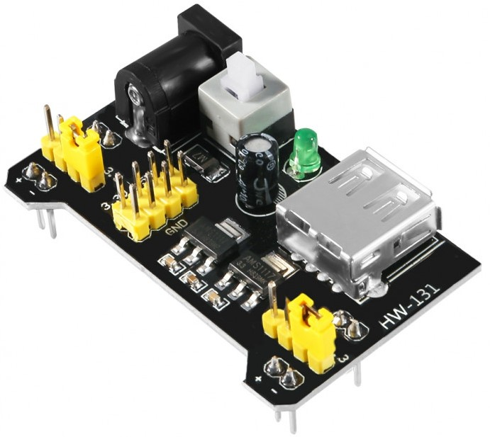
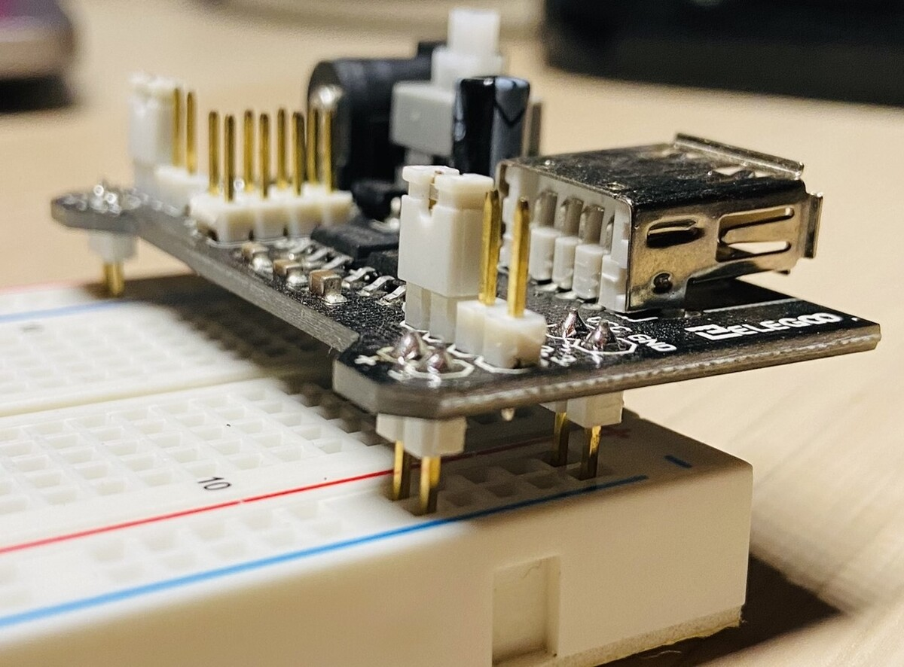
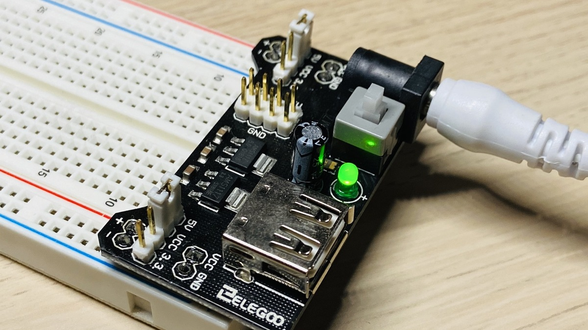
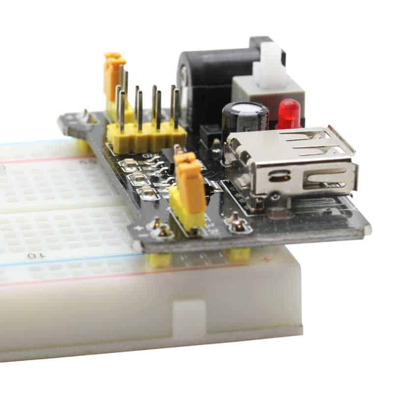

# Introduction
A breadboard power supply is a device that allows you to provide power to your breadboard circuits without the need for batteries or external power supplies.

# How to use

 1. Connect the power supply to a power source: Most breadboard power supplies come with a USB cable, 12v female jack that you can use to connect it to a USB power source, such as a computer or USB wall adapter.

 2. Set the output voltage: Breadboard power supplies usually have a voltage regulator circuit. Set the voltage to the desired level using the voltage adjustment jumper. Make sure you don't exceed the voltage rating of your components.

 

 3. Connect the power supply to the breadboard: The breadboard power supply typically has two output pins that you can connect to the breadboard. Connect the positive (+) output pin to the red (+) power rail on your breadboard and the negative (-) output pin to the blue (-) power rail.

 
 Gently push the power supply board pins into power rails on the breadboard.

 

 4. Connect your components: Once the power supply is connected, you can start connecting your components to the breadboard. Make sure you connect them to the appropriate power rails (positive to red and negative to blue).

 5. Turn on the power supply: Turn on the power supply by pressing the power button (if it has one). Your circuit should now be powered up.

 6. Test your circuit: Test your circuit to make sure it's working properly. If it's not, check your connections and make sure you've set the correct voltage.

 

**Note:** Always read the manufacturer's instructions before using a breadboard power supply, as the exact steps may vary depending on the specific model.
