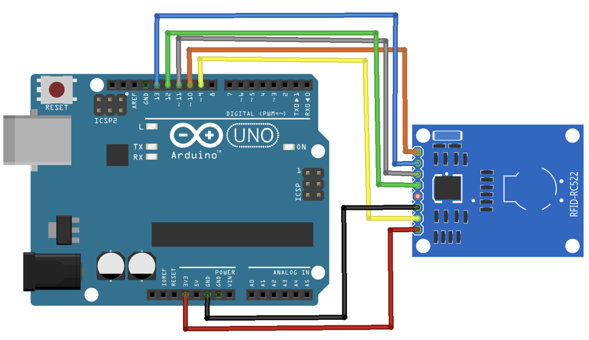
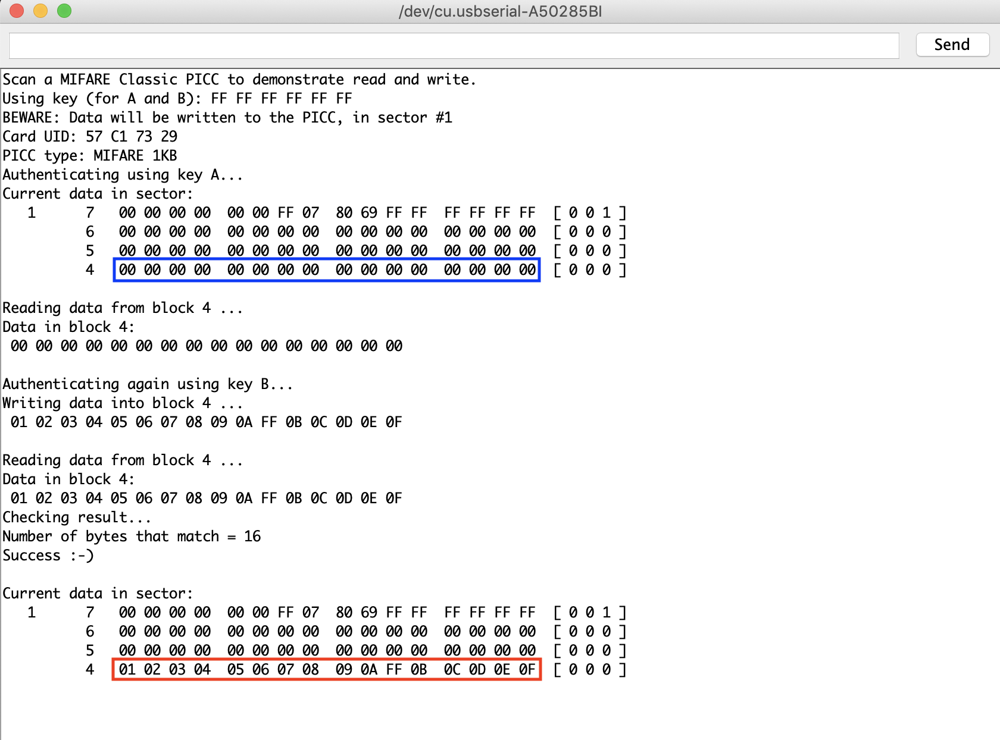

# Introduction

RFID means radio-frequency identification. RFID uses electromagnetic fields to transfer data over short distances. The RFID module 
detects the badges or magnetic cards within 10cm.

RFID or Radio Frequency Identification system consists of two main components, a transponder/tag attached to an object to be identified, and a Transceiver also known as interrogator/Reader. A Reader consists of a Radio Frequency module and an antenna which generates high frequency electromagnetic field. On the other hand, the tag is usually a passive device, meaning it doesn’t contain a battery. Instead it contains a microchip that stores and processes information, and an antenna to receive and transmit a signal.

Passing the tag near the reader, makes it possible to read the Unique Identifier (UID) of the card as well as the recorded data. One of the most commonly found low-cost RFID is the RC522.


# Connecting RC522 module to Arduino

We will connect as follows:

| RC522  | Arduino pin  |
|---     |---|
|SDA (SPI SS)     |10 |
|SCK (SPI SCK)    |13   |
|MOSI    |11   |
|MISO    |12   |
|INT    |Not connected   |
|GND    |GND  |
|RST    |9  |
|3.3V    |3.3V  |



For better understanding, more documentation on the MFRC522 module can be found [here](src/sketch/libraries/MFRC522/doc/rfidmifare.pdf).

# Code example 1: Arduino_MFRC522_DumpInfo.ino

We will use the MFRC522 library from https://github.com/miguelbalboa/rfid.

``` arduino
/* This is a MFRC522 library example; for further details and other examples see: https://github.com/miguelbalboa/rfid
 * 
 * Example sketch/program showing how to read data from a PICC (that is: a RFID Tag or Card) using a MFRC522 based RFID
 * Reader on the Arduino SPI interface.
 * 
 * When the Arduino and the MFRC522 module are connected (see the pin layout below), load this sketch into Arduino IDE
 * then verify/compile and upload it. To see the output: use Tools, Serial Monitor of the IDE (hit Ctrl+Shft+M). When
 * you present a PICC (that is: a RFID Tag or Card) at reading distance of the MFRC522 Reader/PCD, the serial output
 * will show the ID/UID, type and any data blocks it can read. Note: you may see "Timeout in communication" messages
 * when removing the PICC from reading distance too early.
 * 
 * If your reader supports it, this sketch/program will read all the PICCs presented (that is: multiple tag reading).
 * So if you stack two or more PICCs on top of each other and present them to the reader, it will first output all
 * details of the first and then the next PICC. Note that this may take some time as all data blocks are dumped, so
 * keep the PICCs at reading distance until complete.
 *
 * @license Released into the public domain.
 * 
 * Typical pin layout used:
 * -----------------------------------------------------------------------------------------
 *             MFRC522      Arduino       Arduino   Arduino    Arduino          Arduino
 *             Reader/PCD   Uno/101       Mega      Nano v3    Leonardo/Micro   Pro Micro
 * Signal      Pin          Pin           Pin       Pin        Pin              Pin
 * -----------------------------------------------------------------------------------------
 * RST/Reset   RST          9             5         D9         RESET/ICSP-5     RST
 * SPI SS      SDA(SS)      10            53        D10        10               10
 * SPI MOSI    MOSI         11 / ICSP-4   51        D11        ICSP-4           16
 * SPI MISO    MISO         12 / ICSP-1   50        D12        ICSP-1           14
 * SPI SCK     SCK          13 / ICSP-3   52        D13        ICSP-3           15
 * 
 * When using Arduino Pro Mini, use the pin layout of Arduino Nano
 * When using Heltec ESP32 WiFi LoRa see below
 * modified by C. Pham
 */
 
#include< SPI.h>
#include "MFRC522.h"

//#define ESP32  
//#define ARDUINO_Heltec_WIFI_LoRa_32  

#if ARDUINO_Heltec_WIFI_LoRa_32 || defined ESP32
#define SS_PIN 5
#define RFID_SCK 18
#define RFID_MOSI 23
#define RFID_MISO 19
#define RST_PIN 22
#else
#define RST_PIN  9   // Configurable, see typical pin layout above 
#define SS_PIN  10   // Configurable, see typical pin layout above 
#endif

MFRC522 mfrc522(SS_PIN, RST_PIN);     // Create MFRC522 instance

void setup() {

	Serial.begin(38400);

#ifdef ARDUINO_Heltec_WIFI_LoRa_32
	SPI.begin(RFID_SCK, RFID_MISO, RFID_MOSI);    // Initialize SPI bus
#else
	SPI.begin();     // Initialize SPI bus 
#endif

	mfrc522.PCD_Init();	      // Initialize MFRC522 
	delay(4);   // Optional delay. Some board do need more time after init to be ready, see Readme
	
	mfrc522.PCD_DumpVersionToSerial();     // Show details of PCD - MFRC522 Card Reader details 
	Serial.println(F("Scan PICC to see UID, SAK, type, and data blocks..."));
}	
void loop() {

	// Reset the loop if no new card present on the sensor/reader. This saves the entire process when idle.
	if ( ! mfrc522.PICC_IsNewCardPresent()) {
	return;
	}

	// Select one of the cards
	if ( ! mfrc522.PICC_ReadCardSerial()) {
	return;
	}

	// Dump debug info about the card; PICC_HaltA() is automatically called 
	mfrc522.PICC_DumpToSerial(&(mfrc522.uid));
}
```


The complete code for example 1 can be found [here](src/sketch/Arduino_MFRC522_DumpInfo/Arduino_MFRC522_DumpInfo.ino).


Note that if you use an ESP32 such as the ESP32-WROOM or the Heltec ESP32 described later in [Use board with WiFi](/advanced_board/board_with_wifi) to have WiFi Internet connectivity to handle/process your tag ID then you have to connect the RFID reader as defined in the code.

In the code, you can see the main 4 functions that are used:  `mfrc522.PCD_Init()` to initialize the library and the reader to be executed once, then (1) `mfrc522.PICC_IsNewCardPresent()` to test whether an RFID tag is detected, (2) `mfrc522.PICC_ReadCardSerial()` to check whether data can be read from the RFID tag and, (3) `mfrc522.PICC_DumpToSerial()` to dump the RFID tag content. The last function is very specific to this example as dumping the RFID tag content is not something you do oftenly.

After flashing the `Arduino_MFRC522_DumpInfo` sketch, open the serial monitor and you should see something like the image below:


As the whole content of the card is dumped, when bringing the card near the RC522 module, you need to keep the card near the reader until all the information is completely read.


In the image above, you can see the UID number of the tag and also the 1kB of memory which is divided into 16 sectors (from 0 to 15). 
Each sector has 4 blocks (blocks are numbered sequenctially from 0 to 63) and each block can store 16 bytes of data (16 sectors x 4 blocks x 16 bytes of data = 1024 bytes = 1K memory). This information is highlighted in the image for sector 10.

The last block of each sector (for instance block 7 for sector 1) is called the ‘Sector Trailer’ and contains information called Access Bits to grant read and write access to remaining blocks in a sector. That means only the bottom 3 blocks (for instance block 4, 5 & 6 for sector 1) of each sector are actually available for data storage, meaning we have 48 bytes per 64-byte sector available for our own use.

Also Block 0 of sector 0 is known as Manufacturer Block/Manufacturer Data and it contains the IC manufacturer data, and the Unique IDentifier (UID).


WARNING: It is very risky to overwrite the Manufacturer Block and it may permanently lock the card.


To write the information in a tag, it is necessary to define three things: the sector, address and the data. We can put any hexadecimal data.


Also remember never select last block of any sector. Writing into ‘Sector Trailer’ block can make the block unusable.


# Code example 2: Arduino_MFRC522_ReadNUID.ino

``` arduino
#include< SPI.h>
#include "MFRC522.h"

//#define ESP32  
//#define ARDUINO_Heltec_WIFI_LoRa_32  

#if ARDUINO_Heltec_WIFI_LoRa_32 || defined ESP32
#define SS_PIN 5
#define RFID_SCK 18
#define RFID_MOSI 23
#define RFID_MISO 19
#define RST_PIN 22
#else
#define RST_PIN  9   // Configurable, see typical pin layout above 
#define SS_PIN  10   // Configurable, see typical pin layout above 
#endif

MFRC522 mfrc522(SS_PIN, RST_PIN);     // Create MFRC522 instance

// Init array that will store new NUID
byte nuidPICC[4];

void setup() {

	Serial.begin(38400);

#ifdef ARDUINO_Heltec_WIFI_LoRa_32
	SPI.begin(RFID_SCK, RFID_MISO, RFID_MOSI);    // Initialize SPI bus
#else
	SPI.begin();     // Initialize SPI bus 
#endif

	rfid.PCD_Init();	      // Initialize MFRC522 
}

void loop() {

	// Reset the loop if no new card present on the sensor/reader. This saves the entire process when idle.
	if ( ! rfid.PICC_IsNewCardPresent()) {
		return;
	}

	// Verify if the NUID has been readed
	if ( ! rfid.PICC_ReadCardSerial()) {
		return;
	}

	Serial.print(F("PICC type: "));
	MFRC522::PICC_Type piccType = rfid.PICC_GetType(rfid.uid.sak);
	Serial.println(rfid.PICC_GetTypeName(piccType));

	// Check is the PICC of Classic MIFARE type
	if (piccType != MFRC522::PICC_TYPE_MIFARE_MINI &&  
    		piccType != MFRC522::PICC_TYPE_MIFARE_1K &&
    		piccType != MFRC522::PICC_TYPE_MIFARE_4K) {
    		Serial.println(F("Your tag is not of type MIFARE Classic."));
		return;
	}
	
	if (rfid.uid.uidByte[0] != nuidPICC[0] || 
    		rfid.uid.uidByte[1] != nuidPICC[1] || 
    		rfid.uid.uidByte[2] != nuidPICC[2] || 
    		rfid.uid.uidByte[3] != nuidPICC[3] ) {
    		Serial.println(F("A new card has been detected."));

		// Store NUID into nuidPICC array
		for(byte i = 0; i < 4; i++) {
			nuidPICC[i] = rfid.uid.uidByte[i];
		}

		Serial.println(F("The NUID tag is:"));
		Serial.print(F("In hex: "));
		printHex(rfid.uid.uidByte, rfid.uid.size);
		Serial.println();
 		Serial.print(F("In dec: "));   
    		printDec(rfid.uid.uidByte, rfid.uid.size);
    		Serial.println();
	}
	else Serial.println(F("Card read previously."));

	// Halt PICC
	rfid.PICC_HaltA();
	
	// Stop encryption on PCD	
	rfid.PCD_StopCrypto1();
}


/**
 * Helper routine to dump a byte array as hex values to Serial. 
 */	
void printHex(byte *buffer, byte bufferSize) {
	for(bytei = 0; i < bufferSize; i++) {
 	Serial.print(buffer[i], HEX); 
  }
}

/**
 * Helper routine to dump a byte array as hex values to Serial. 
 */
void printDec(byte *buffer, byte bufferSize) {
	for(bytei = 0; i < bufferSize; i++) {
 	Serial.print(buffer[i], DEC); 
  }
}
```


The complete code for example 2 can be found [here](src/sketch/Arduino_MFRC522_ReadNUID/Arduino_MFRC522_ReadNUID.ino).


If you run the example, you can see that the processing task is much faster than the previous example. This is typically the operation you will perform in a real-world RFID-based application: read the card ID, then act according to the ID.

Once you run the example and bring the card near the RC522 module, you should see the card UID as shown in the image below.


# Code example 3: Arduino_MFRC522_ReadAndWrite.ino

For those of you who want to go further, there is another example which you can use and understand.


The complete code for example 3 can be found [here](src/sketch/Arduino_MFRC522_ReadAndWrite/Arduino_MFRC522_ReadAndWrite.ino).


The image below shows the screen on opening serial monitor.


Once you move the card near the RFID RC522 module, the code in this example rewrites data in sector 1, block 4 as can be seen in the image below.




Remember that you should never select last block of any sector (here block 7 for sector 1) for write operations.


# Assignment: Write a program

For those of you who want to go further, you can start with the [Arduino_MFRC522_ReadAndWrite.ino](src/sketch/Arduino_MFRC522_ReadAndWrite/Arduino_MFRC522_ReadAndWrite.ino) code to develop a simple access authorization system. The principle to implement is as follows:

- Write on RFID card: each team stores on its own RFID card (sector 1, block4) the birthday of one of its member: year (1 byte), month (1 byte) and day (1 byte)
- Read from RFID card: each team would read the stored birthday from RFID card and will authorize access to ONLY its own card and ONE of the other team's card
- Test to see if your system works as expected
- Going further: You can use the OLED example to display on an attached OLED screen whether authorization is granted or not

