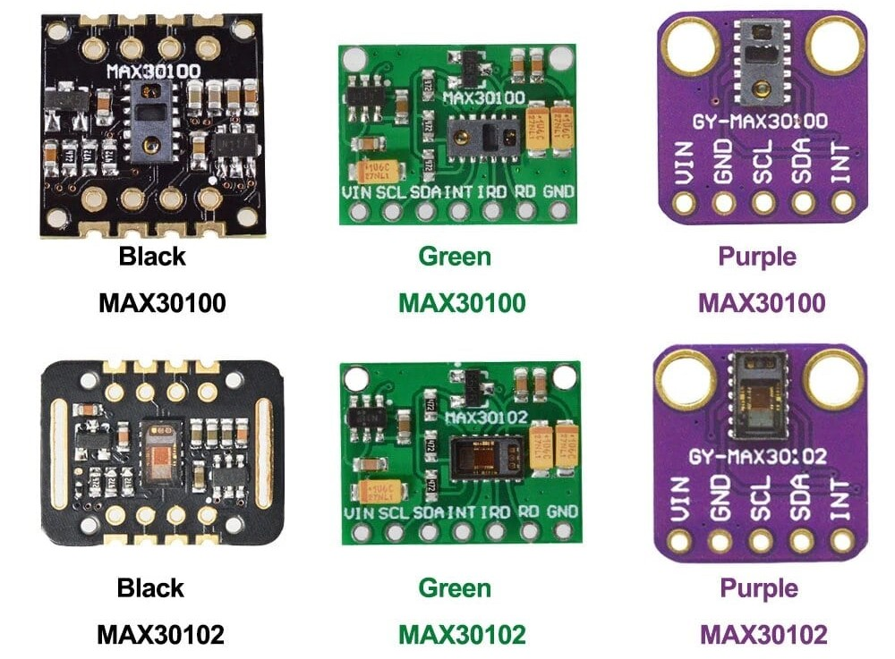
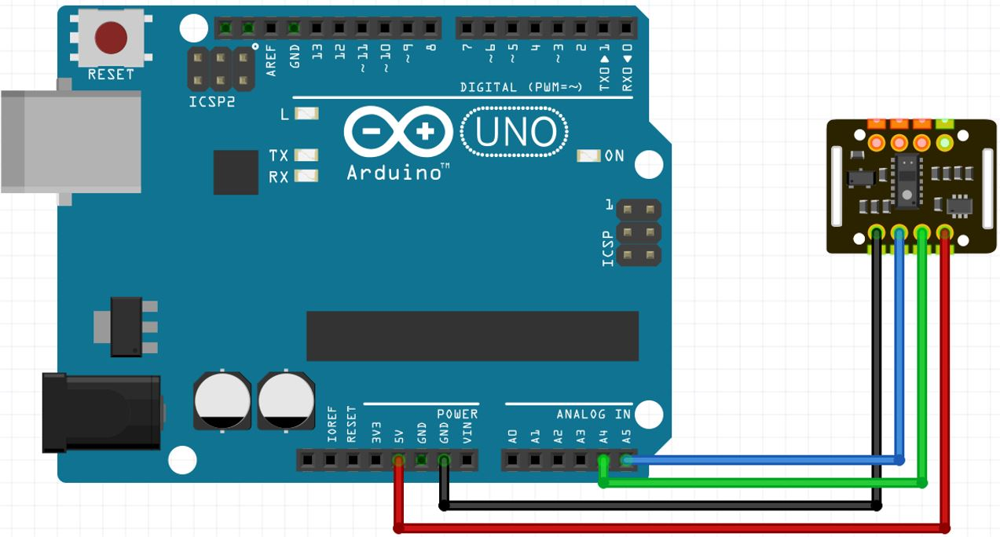

# Introduction

The MAX30102 is an integrated pulse oximetry and heart-rate monitor biosensor module. It includes internal LEDs, photodetectors, optical elements, and low-noise electronics with ambient light rejection. The MAX30102 provides a complete system solution to ease the design-in process for mobile and wearable devices.

The MAX30102 operates on a single 1.8V power supply and a separate 3.3V power supply for the internal LEDs. Communication is through a standard I2C-compatible interface. The module can be shut down through software with zero standby current, allowing the power rails to remain powered at all times.



# Heart Rate Measurement

To measure the heart rate, we do not require the Red LED, only the IR LED is needed. This is because oxygenated hemoglobin absorbs more infrared light.

The heartbeat rate is the ratio of time between two consecutive heartbeats. Similarly, when the human blood is circulated in the human body then this blood is squeezed in capillary tissues. As a result, the volume of capillary tissues is increased but this volume is decreased after each heartbeat. This change in volume of capillary tissues affects the infrared light of the sensor, which transmits light after each heartbeat.

# Wiring



1. VCC:	5v of Arduino
2. GND:	GND of Arduino
3. SCL:	A5 of Arduino
4. SDA:	A4 of Arduino

# Code example

xxyyzz

```c

```

# Further documentation

Further documentation for this sensor is available [here](https://microcontrollerslab.com/max30102-pulse-oximeter-heart-rate-sensor-arduino/).