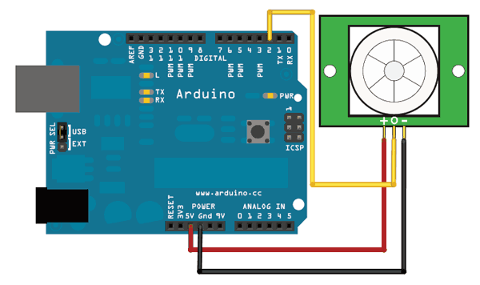

# Introduction

PIR sensors allow you to sense motion, almost always used to detect whether a human has moved in or out of 
the sensors range. They are small, inexpensive, low-power, easy to use and don't wear out. For that reason they 
are commonly found in appliances and gadgets used in homes or businesses. They are often referred to as PIR, 
"Passive Infrared", "Pyroelectric", or "IR motion" sensors.
                    


                 
# Connecting to Arduino


                    
# Code example

``` arduino
/********************
 *  Program:  PIR sensor tester
 ********************/
    
int ledPin = 13;               // choose the pin for the LED
int inputPin = 2;               // choose the input pin (for PIR sensor)
int pirState = LOW;             // we start, assuming no motion detected
int val = 0;                    // variable for reading the pin status

void setup(){
  pinMode(ledPin, OUTPUT);      // declare LED as output
  pinMode(inputPin, INPUT);     // declare sensor as input

  Serial.begin(38400);
}

void loop(){
  val = digitalRead(inputPin);  // read input value
  if (val == HIGH) {            // check if the input is HIGH
    digitalWrite(ledPin, HIGH);  // turn LED ON
    if (pirState ==  LOW){
      // we have just turned on
      Serial.println("Motion detected!");
      // We only want to print on the output change, not state
      pirState = HIGH;
   }
  } else {
    digitalWrite(ledPin,LOW); // turn LED OFF
    if (pirState == HIGH){
      // we have just turned of
      Serial.println("Motion ended!");
      // We only want to print on the output change, not state
      pirState = LOW;
    }
  }
}
```

# Further documentation

Documentation for this sensor is available [here](https://learn.adafruit.com/pir-passive-infrared-proximity-motion-sensor/how-pirs-work).

