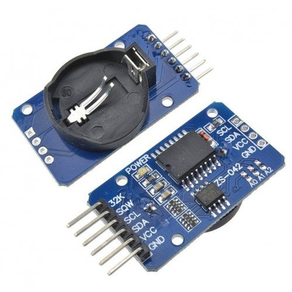
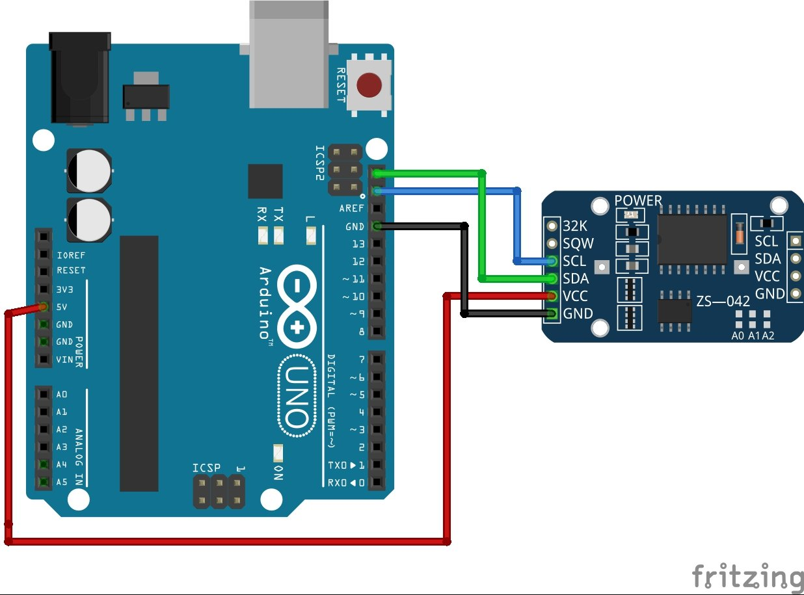
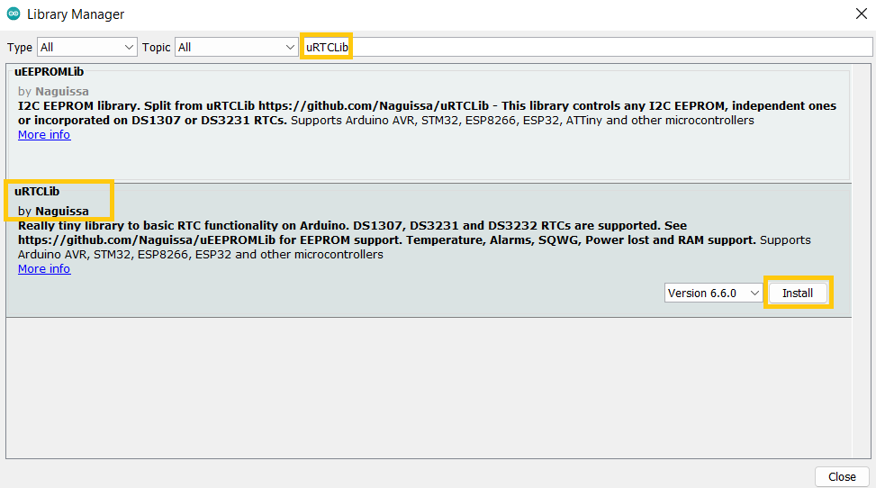
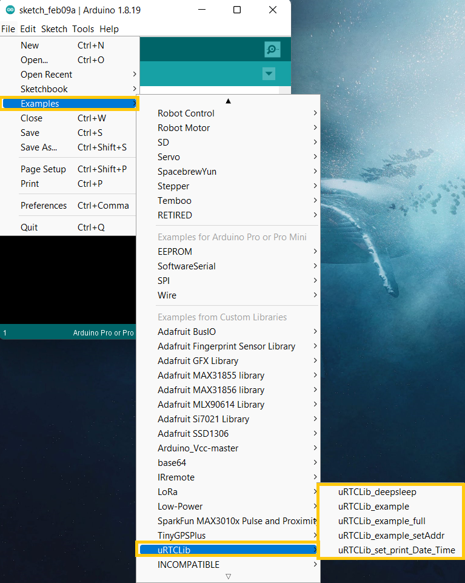
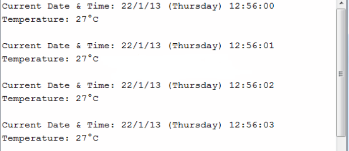

# Introduction

We are all aware that the majority of MCUs we use in our projects are time-agnostic, meaning they have no concept of the passing of time. The DS3231 Precision RTC module is useful on occasions when timing a project is crucial, but for the most of our projects, it works nicely. It can be used for a variety of tasks, such as data logging and time stamping, clocks, timers and alarms.



# Wiring



1. VCC:	5v of Arduino
2. GND:	GND of Arduino
3. SCL:	A5 of Arduino
4. SDA:	A4 of Arduino

# Installing DS3231 Library

To install the DS3231 library navigate to the Arduino library manager from the Sketch menu as shown below
Sketch > Include Library > Manage Libraries


when the library manager opens up, search for **uRTCLib** and install the version by **Naguissa** as shown



We should see the **INSTALLED** inscription after the installation is done


# Code example

There are a number of code examples that come with the library installation.

All we have to do is navigate to File > Examples > uRTCLib



Feel free to check out any of the above code examples later on. For now we will use the simplified code sample below

Setting of the time and date can be done on line 18

```c
  rtc.set(0, 56, 12, 5, 13, 1, 22);
  // rtc.set(second, minute, hour, dayOfWeek, dayOfMonth, month, year)
```

**NOTE:** we have to set the date and time of the rtc once in order to have a correct date and time. Also make sure to comment out line 18 after running the code the first time.

```c
#include "Arduino.h"
#include "uRTCLib.h"

// uRTCLib rtc;
uRTCLib rtc(0x68);

char daysOfTheWeek[7][12] = {"Sunday", "Monday", "Tuesday", "Wednesday", "Thursday", "Friday", "Saturday"};

void setup() {
  Serial.begin(9600);
  delay(3000); // wait for console opening

  URTCLIB_WIRE.begin();

  // Comment out below line once you set the date & time.
  // Following line sets the RTC with an explicit date & time
  // for example to set January 13 2022 at 12:56 you would call:
  rtc.set(0, 56, 12, 5, 13, 1, 22);
  // rtc.set(second, minute, hour, dayOfWeek, dayOfMonth, month, year)
  // set day of week (1=Sunday, 7=Saturday)
}

void loop() {
  rtc.refresh();

  Serial.print("Current Date & Time: ");
  Serial.print(rtc.year());
  Serial.print('/');
  Serial.print(rtc.month());
  Serial.print('/');
  Serial.print(rtc.day());

  Serial.print(" (");
  Serial.print(daysOfTheWeek[rtc.dayOfWeek()-1]);
  Serial.print(") ");

  Serial.print(rtc.hour());
  Serial.print(':');
  Serial.print(rtc.minute());
  Serial.print(':');
  Serial.println(rtc.second());

  Serial.print("Temperature: ");
  Serial.print(rtc.temp()  / 100);
  Serial.print("\xC2\xB0");   //shows degrees character
  Serial.println("C");

  Serial.println();
  delay(1000);
}
```

Here's what the output looks like.



# Further documentation

Documentation for this xxyyzz is available [here](https://lastminuteengineers.com/ds3231-rtc-arduino-tutorial/).