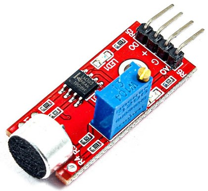
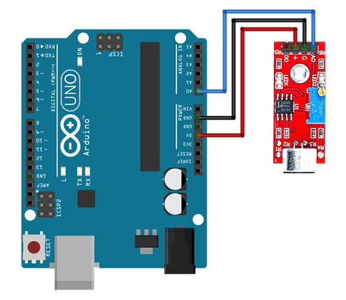

# Introduction

The BOB-09964 breakout board couples a small electret microphone (100Hz-10kHz) with 
a 60x mic preamplifier to amplify the sounds of voice, claps, door knocks or any loud enough to be picked 
up by a microcontroller's analog-to-digital converter.

The Electret Mic Breakout translates amplitude (not volume) by capturing sound waves between two conducting 
plates (one a vibrating diaphragm and the other fixed) in the microphone and converting them into 
electrical waves. These electrical signals are then amplified and picked up by your microcontroller’s ADC.



# Wiring

Sensor > Arduino wiring is as fellows:
  VCC: 5v
  GND: GND
  AO: A0(analog pin)



**Note:** you can adjust the potentiometer on the sensor to increase/decrease the sensitivity

# Code example

We will simply use analog pin A0 to get sound level. Calibration is necessary to have adequate value for `SENSITIVITY` depending on your application.

```c
/********************
 *  Program:  MIC Sensor tester
 *  Description: print audio volume level to serial. Print "Sound" on loud sound.
 ********************/

#define AUDIO_READ_PIN A0 // Analog pin 0 to read the output of the sensor
#define SENSITIVITY 850  

void setup(){
  Serial.begin(115200); // initialize the serial port
}

void loop(){
  int sound_wave =   analogRead(AUDIO_READ_PIN);
  Serial.print(sound_wave);
  
  if (sound_wave > SENSITIVITY) {  // On loud sound
    Serial.println("Sound!");
    delay(500);
  }  
  delay(100); // ms
}
```

Here is a more elaborated code which uses an interrupt to sample at 4kHz. The byte stream can be considered as an SPL stream that can be injected (or saved) into a player. It requires the `TimerOne` library.

```c
#include <avr/io.h>
#include <stdio.h>
#include <avr/sleep.h>
#include "TimerOne.h"

uint16_t val ;
uint8_t val8bit ;
void uart_putbyte (uint8_t c)
{
  loop_until_bit_is_set(UCSR0A, UDRE0); // check that UART is available
  UDR0 = c ; // copy character in UART
}

void setup()
{
  //Serial.begin(125000); // UART speed to transmit at 64 000 bit/s
  Serial.begin(38400); // for 4000Hz sampling so requires only 32000bps
  Timer1.initialize(250); // timer initialisation
  Timer1.attachInterrupt(callback); // callback function to be called
}

void callback ()
{
    val = analogRead(8) ; // A-D conversion
    val8bit = ((val >> 2) ) ; // into 8-bit sample
    uart_putbyte (val8bit) ; // send to UART
    //Serial.println(val8bit_signed,DEC);
}

void loop()
{
  // do almost nothing
  delay (1000);
}
```

# Further documentation

Documentation for this sound sensor is available [here](http://cdn.sparkfun.com/datasheets/Sensors/Sound/CEM-C9745JAD462P2.54R.pdf).

