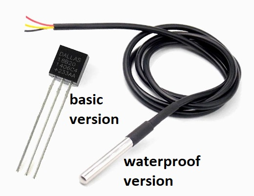
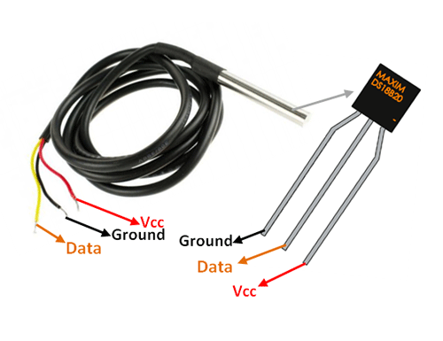
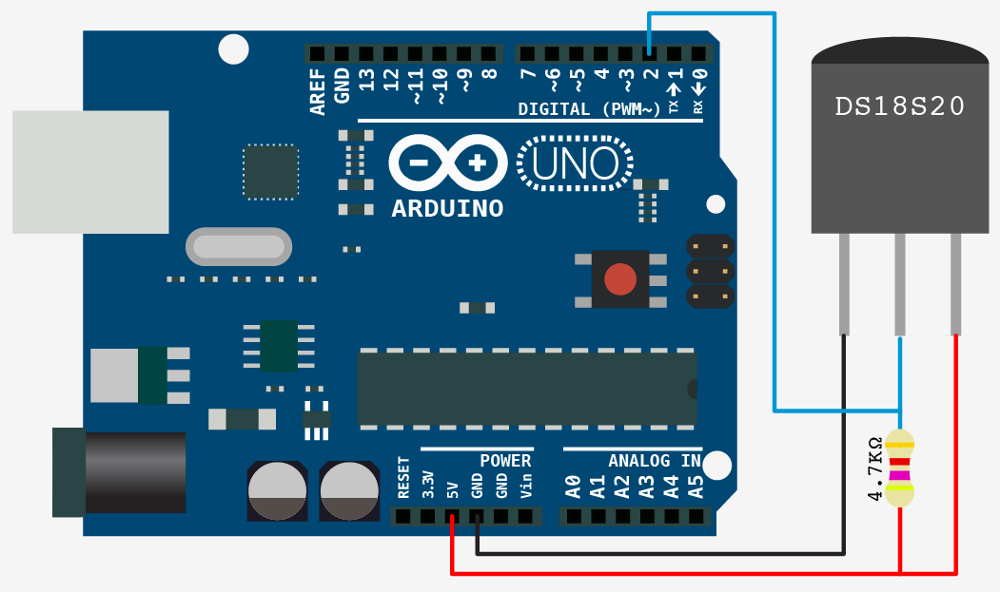

# Introduction

The DS18B20 digital temperature sensor is a 1-Wire sensor. So it communicates with a master card via a 
1-Wire bus. Several sensors can be connected to the same 1-Wire bus. In addition, each sensor has a unique 
address, so there is no risk of conflict.



A 1-Wire bus is conventionally composed of the three wires: a ground, a power (5V) and a data. A 
single external component is required to operate a 1-Wire bus: a simple 4.7K ohm resistor in 
pull-resistance to the power supply on the data pin.

## Connecting to Arduino



To use a 1-Wire sensor, you need to include the [OneWire](https://github.com/PaulStoffregen/OneWire) library. In addition, using the [Dallas Temperature](https://github.com/milesburton/Arduino-Temperature-Control-Library/blob/master/DallasTemperature.h) library makes getting the temperature easy.



# Code example

```c
/********************
 * DS18B20 temperature sensor tester
 * https://create.arduino.cc/projecthub/TheGadgetBoy/ds18b20-digital-temperature-sensor-and-arduino-9cc806
 ********************/

// First we include the libraries
#include <OneWire.h>
#include <DallasTemperature.h>
 
// Data wire is plugged into pin 2 on the Arduino 
#define ONE_WIRE_BUS 2 

// Setup a oneWire instance to communicate with any OneWire devices  
// (not just Maxim/Dallas temperature ICs) 
OneWire oneWire(ONE_WIRE_BUS); 

// Pass our oneWire reference to Dallas Temperature. 
DallasTemperature sensors(&oneWire);

void setup() 
{ 
 // start serial port 
 Serial.begin(38400); 
 Serial.println("Dallas Temperature IC Control Library Demo"); 
 // Start up the library 
 sensors.begin(); 
} 

void loop() 
{ 
 // call sensors.requestTemperatures() to issue a global temperature 
 // request to all devices on the bus 

 Serial.print(" Requesting temperatures..."); 
 sensors.requestTemperatures(); // Send the command to get temperature readings 
 Serial.println("DONE"); 

 Serial.print("Temperature is: "); 
 Serial.print(sensors.getTempCByIndex(0)); // Why "byIndex"?  
   // You can have more than one DS18B20 on the same bus.  
   // 0 refers to the first IC on the wire 
 delay(1000); 
}
```

# Further documentation

Documentation for this sensor is available [here](http://datasheets.maximintegrated.com/en/ds/DS18B20.pdf).