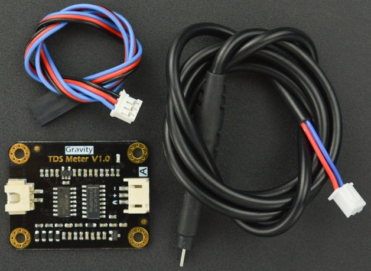
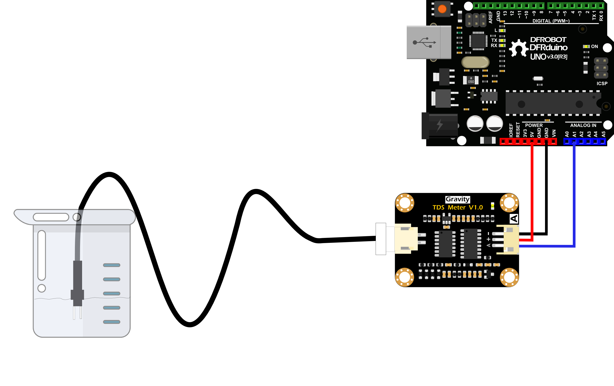
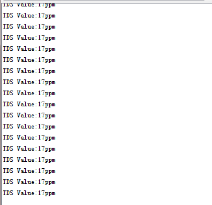

# Introduction

TDS (Total Dissolved Solids) indicates how many milligrams of soluble solids are dissolved in one liter of water. In general, the higher the TDS value, the more soluble solids are dissolved in water, and the less clean the water is. Therefore, the TDS value can be used as one reference point for reflecting the cleanliness of water.



# Wiring



1. VCC(+):	5v of Arduino
2. GND(-):	GND of Arduino
3. A:	A1 of Arduino

# Code example

```c
/***************************************************
 DFRobot Gravity: Analog TDS Sensor / Meter For Arduino
 <https://www.dfrobot.com/wiki/index.php/Gravity:_Analog_TDS_Sensor_/_Meter_For_Arduino_SKU:_SEN0244>

 Created 2017-8-22
 By Jason <jason.ling@dfrobot.com@dfrobot.com>

 GNU Lesser General Public License.
 See <http://www.gnu.org/licenses/> for details.
 All above must be included in any redistribution

 /***********Notice and Trouble shooting***************
 1. This code is tested on Arduino Uno and Leonardo with Arduino IDE 1.0.5 r2 and 1.8.2.
 2. More details, please click this link: <https://www.dfrobot.com/wiki/index.php/Gravity:_Analog_TDS_Sensor_/_Meter_For_Arduino_SKU:_SEN0244>
 ****************************************************/

#define TdsSensorPin A1
#define VREF 5.0      // analog reference voltage(Volt) of the ADC
#define SCOUNT  30           // sum of sample point
int analogBuffer[SCOUNT];    // store the analog value in the array, read from ADC
int analogBufferTemp[SCOUNT];
int analogBufferIndex = 0,copyIndex = 0;
float averageVoltage = 0,tdsValue = 0,temperature = 25;

void setup()
{
    Serial.begin(115200);
    pinMode(TdsSensorPin,INPUT);
}

void loop()
{
   static unsigned long analogSampleTimepoint = millis();
   if(millis()-analogSampleTimepoint > 40U)     //every 40 milliseconds,read the analog value from the ADC
   {
     analogSampleTimepoint = millis();
     analogBuffer[analogBufferIndex] = analogRead(TdsSensorPin);    //read the analog value and store into the buffer
     analogBufferIndex++;
     if(analogBufferIndex == SCOUNT) 
         analogBufferIndex = 0;
   }   
   static unsigned long printTimepoint = millis();
   if(millis()-printTimepoint > 800U)
   {
      printTimepoint = millis();
      for(copyIndex=0;copyIndex<SCOUNT;copyIndex++)
        analogBufferTemp[copyIndex]= analogBuffer[copyIndex];
      averageVoltage = getMedianNum(analogBufferTemp,SCOUNT) * (float)VREF / 1024.0; // read the analog value more stable by the median filtering algorithm, and convert to voltage value
      float compensationCoefficient=1.0+0.02*(temperature-25.0);    //temperature compensation formula: fFinalResult(25^C) = fFinalResult(current)/(1.0+0.02*(fTP-25.0));
      float compensationVolatge=averageVoltage/compensationCoefficient;  //temperature compensation
      tdsValue=(133.42*compensationVolatge*compensationVolatge*compensationVolatge - 255.86*compensationVolatge*compensationVolatge + 857.39*compensationVolatge)*0.5; //convert voltage value to tds value
      //Serial.print("voltage:");
      //Serial.print(averageVoltage,2);
      //Serial.print("V   ");
      Serial.print("TDS Value:");
      Serial.print(tdsValue,0);
      Serial.println("ppm");
   }
}
int getMedianNum(int bArray[], int iFilterLen) 
{
      int bTab[iFilterLen];
      for (byte i = 0; i<iFilterLen; i++)
      bTab[i] = bArray[i];
      int i, j, bTemp;
      for (j = 0; j < iFilterLen - 1; j++) 
      {
      for (i = 0; i < iFilterLen - j - 1; i++) 
          {
        if (bTab[i] > bTab[i + 1]) 
            {
        bTemp = bTab[i];
            bTab[i] = bTab[i + 1];
        bTab[i + 1] = bTemp;
         }
      }
      }
      if ((iFilterLen & 1) > 0)
    bTemp = bTab[(iFilterLen - 1) / 2];
      else
    bTemp = (bTab[iFilterLen / 2] + bTab[iFilterLen / 2 - 1]) / 2;
      return bTemp;
}
```

After uploading the sample code above, insert the TDS probe into water and gently stir it and wait for the readings to be stable.



# Further Documentation and Calibration

Documentation for this sensor is available [here](https://wiki.dfrobot.com/Gravity__Analog_TDS_Sensor___Meter_For_Arduino_SKU__SEN0244).