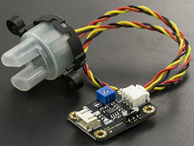

# Introduction

Turbidity sensor detects water quality by measuring the levels of opaqueness. It uses light to detect suspended particles in water by measuring the light transmittance and scattering rate, which changes with the amount of total suspended solids (TSS) in water. As the TTS increases, the liquid turbidity level increases. Turbidity sensors are used to measure water quality in rivers and streams, wastewater and effluent measurements, control instrumentation for settling ponds, sediment transport research and laboratory measurements. 

# Wiring

xxyyzz

# Code example
xxyyzz

# Further documentation
Documentation for this xxyyzz is available [here](https://).