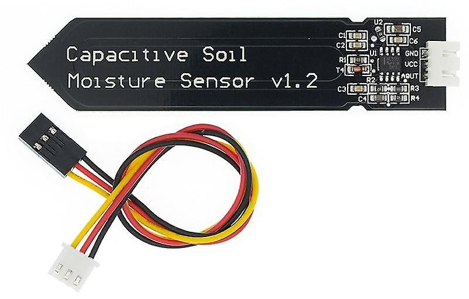
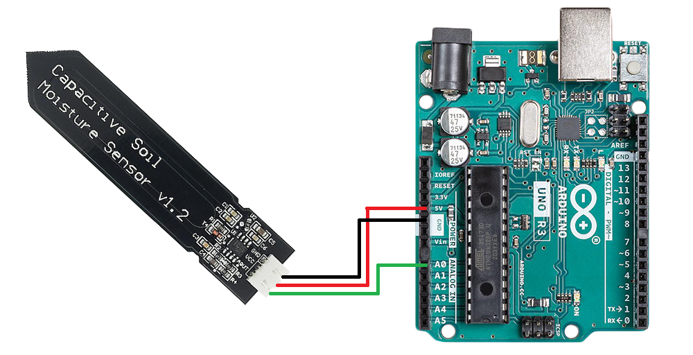

# Introduction

Soil moisture is basically the amount/content of water present in the soil. This can be measured using a soil moisture sensor either resistive or capacitive. Here we will use Capacitive Soil Moisture Sensor v1.2. This sensor measures the volumetric content of water inside the soil and gives us the moisture level as output.

This soil moisture sensor measures soil moisture levels by capacitive sensing rather than resistive sensing like other sensors on the market. It is made of corrosion-resistant material which gives it excellent service life. Insert it into the soil around your plants and monitor the real-time soil moisture data. This module includes an onboard voltage regulator which gives it an operating voltage range of 3.3 ~ 5.5V. It is perfect for low-voltage microcontroller with both 3.3V and 5V power supply.



# Schematic Wiring



Arduino > Sensor Wiring are as follows:
 - A0 = AOUT (analog out)
 - 5v = VCC
 - GND = GND

# Code example

Code sample for reading out the capacitive soil moisture sensor data

```c
//make sure to place your sensor in and out of a bowl of water and record both values above.
const int AirValue = 600;   //this is the value when the sensor isnt in the soil/water
const int WaterValue = 300;  //this is the value when there's enough water in the soil/bowl

int soilMoistureValue = 0;
int soilmoisturepercent=0;

void setup() {
  Serial.begin(9600); // open serial port, set the baud rate to 9600 bps
}

void loop() {

    soilMoistureValue = analogRead(A0);  //put Sensor insert into soil
    Serial.println(soilMoistureValue);

    soilmoisturepercent = map(soilMoistureValue, AirValue, WaterValue, 0, 100);

    if(soilmoisturepercent >= 100){
        Serial.println("100 %");
    }else if(soilmoisturepercent <=0){
        Serial.println("0 %");
    }else if(soilmoisturepercent >0 && soilmoisturepercent < 100){
        Serial.print(soilmoisturepercent);
        Serial.println("%");
    }

    delay(250);
}
```
Once the code is uploaded, you can click on serial monitor & check soil moisture value in percentage(%). Then test the soil moisture value by dipping the soil moisture sensor probe in water or soil.

# Further documentation
Further documentation for this sensor is available [here](https://how2electronics.com/interface-capacitive-soil-moisture-sensor-arduino/).