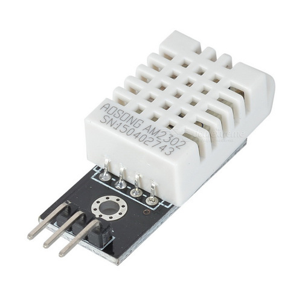

# Introduction

The DHT-22 (AM2302) is a low cost device for measuring humidity and temperature. The DHT sensors are made of two 
parts, a capacitive humidity sensor and a thermistor. The device requires a 3 to 5V power supply. It 
uses a single data wire to communicate back to the Arduino. It has a fairly slow update rate and should 
only be sampled every 2 seconds.


In the second figure, you can see an AM2305 sensor. These sensors are compatible with DHT22 and have exactly the same code.


# Connecting to Arduino


You can find the DHT22 (like the one shown in the figure below) on a small PCB which already has the resistor, in which case you don't need to add the resistor.



# Code example

To use a DHT sensor model, you need to include the [DHT library](https://github.com/adafruit/DHT-sensor-library). If you have the DHT11 sensor instead of the DHT22, comment `DHTTYPE DHT22` and uncomment `DHTTYPE DHT11` lines.
                
``` c
/********************
 * Program:  DHT22 sensor tester
 * Description: print humidity and temperature to serial
 ********************/
 
#include <DHT.h>

//Constants
#define DHTPIN 2     // what pin on the arduino is the DHT22 data line connected to
#define DHTTYPE DHT22   // DHT 22  (AM2302)
//#define DHTTYPE DHT11   // DHT 11
DHT dht(DHTPIN, DHTTYPE); // Initialize DHT sensor for normal 16mhz Arduino

void setup() { // to run once
  Serial.begin(38400); // Initialize the serial port
  Serial.println("DHT22 Humidity - Temperature Sensor");
  Serial.println("RH\t Temp (C)");
  dht.begin();
}

void loop() {
  // Reading temperature or humidity takes about 250 milliseconds!
  // Sensor readings may also be up to 2 seconds 'old' (its a very slow sensor)
  float h = dht.readHumidity();
  float t = dht.readTemperature();
  // Check if any reads failed and exit early (to try again).
  if (isnan(h) || isnan(t)) {
    Serial.println("Failed to read from DHT22 sensor!");
    return;
  }

  Serial.print(h); 
  Serial.print(" %\t\t");
  Serial.print(t); 
  Serial.print(" °C");
  // Wait a few seconds between measurements. The DHT22 should not be read at a higher frequency of
  // about once every 2 seconds. So we add a 3 second delay to cover this.
  delay(3000);
}

```

# Further information

Documentation for DHT22 (or under ref. AM2302 or AM2303) humidity sensor is available [here](http://static.cactus.io/docs/sensors/temp-humidity/dht22/dht22-datasheet.pdf).
