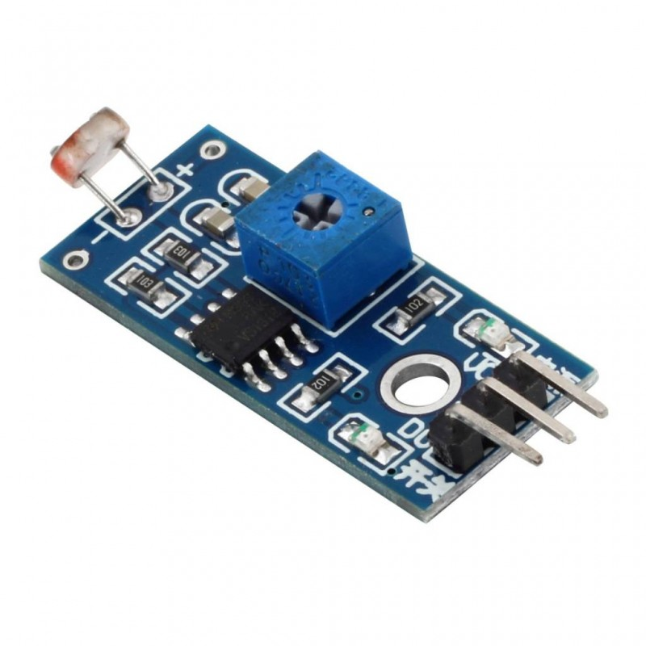

# Introduction

Photoresistors, also known as light dependent resistors (LDR), are light sensitive devices most often used to indicate the presence or absence of light, or to measure the light intensity. In the dark, their resistance is very high, sometimes up to 1MΩ, but when the LDR sensor is exposed to light, the resistance drops dramatically even down to a few ohms, depending on the light intensity. LDRs have a sensitivity that varies with the wavelength of the light applied and are nonlinear devices. 


# Connecting to Arduino


The typical resistor is 10kOhms but you can also find the LDRs (like the one shown in the figure below) that already contains the resistor, in which case you don't need to add the resistor.

Otherwise, it is a simple analog example where analog pin A0 is used.



# Code example

Don't be surprised, depending on your sensor model, the returned value could be reversed, i.e. low value can mean very bright and vice-versa.

``` c
/********************
 * Program:  Photocell simple testing sketch.
 * Connect one end of the photocell to 5V, the other end to Analog 0.
 * Then connect one end of a 10K resistor from Analog 0 to ground
 * For more information see http://learn.adafruit.com/photocells
 ********************/

int photocellPin = A0; // the cell and 10K pulldown are connected to A0
int photocellReading; // the analog reading from the analog resistor divider

void setup() {
  // We'll send debugging information via the Serial monitor
  Serial.begin(38400);
}

void loop() {
  photocellReading = analogRead(photocellPin);
  Serial.print("Analog reading = ");
  Serial.print(photocellReading); // the raw analog reading
  // We'll have a few threshholds, qualitatively determined
  if (photocellReading < 10) {
    Serial.println(" - Black");
  } else if (photocellReading < 200) {
    Serial.println(" - Dark");
  } else if (photocellReading < 500) {
    Serial.println(" - Light");
  } else if (photocellReading < 800) {
    Serial.println(" - Luminous");
  } else {
    Serial.println(" - Bright");
  }
  delay(2000);
}
```

# Further documentation

Documentation for this sensor is available [here](http://www.resistorguide.com/photoresistor/).


# Specification

- Maximum power dissipation is 200mW
- The maximum voltage at 0 lux is 200V
- The peak wavelength is 600nm
- Minimum resistance at 10lux is 1.8kΩ
- Maximum .resistance at 10lux is 4.5kΩ
- Typical resistance at100lux is 0.7kΩ
- Dark resistance after 1 sec is 0.03MΩ
- Dark resistance after 5 sec is 0.25MΩ
