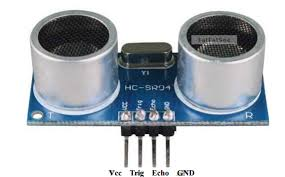
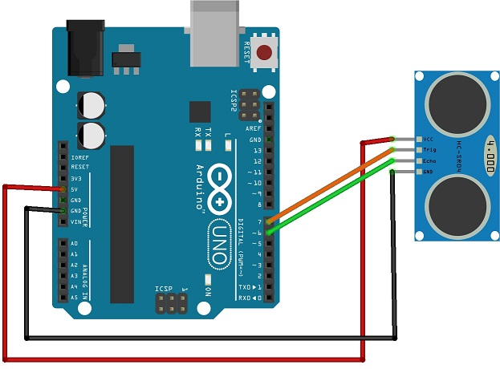

# Introduction

The HC-SR04 is a low-cost ultrasonic ranging sensor for measuring distance. The principle of ultrasonic sensor is similar to sonar or radar in which  interpretation of echoes from radio or sound waves to evaluate the attributes of a target by generating the high-frequency-sound waves (around 40kHz). The transducer used for converting energy into ultrasound or sound waves with ranges above human hearing range is called an ultrasonic transducer. Each HC-SR04 module includes an ultrasonic transmitter, a receiver and a control circuit.




# Connecting to Arduino

There are only four pins that you need to worry about on the HC-SR04.



# Code example

```c
/********************
 *  Program:  HC-SR04 sensor tester
 *  Description: print distance to serial
 ********************/

#define ECHO_PIN 6 	
#define TRIG_PIN 7 

void setup(){
  Serial.begin(38400); // initialize the serial port
  pinMode(TRIG_PIN, OUTPUT);
  digitalWrite(TRIG_PIN, LOW);
  pinMode(ECHO_PIN, INTPUT);
}

// Define a new function that reads and converts the raw reading to distance (cm)
float distance_centimetre() {
  // Send sound pulse
  digitalWrite(TRIG_PIN, HIGH); // pulse started
  delayMicroseconds(12);
  digitalWrite(TRIG_PIN, LOW); // pulse stopped

  // listen for echo 
  float tUs = pulseIn(ECHO_PIN, HIGH); // microseconds
  float distance = tUs / 58; // cm 
  return distance;
}

void loop(){
  Serial.print(distance_centimetre(), DEC);
  Serial.println("cm");
  delay(1000); // ms 
}
```

# Further documentation

Documentation for this sensor is available [here](https://cdn.sparkfun.com/datasheets/Sensors/Proximity/HCSR04.pdf). If you want to understand the details of how an ultra-sonic sensor for measuring distance works, you can have a look at [this page](https://howtomechatronics.com/tutorials/arduino/ultrasonic-sensor-hc-sr04/) from https://howtomechatronics.com.

