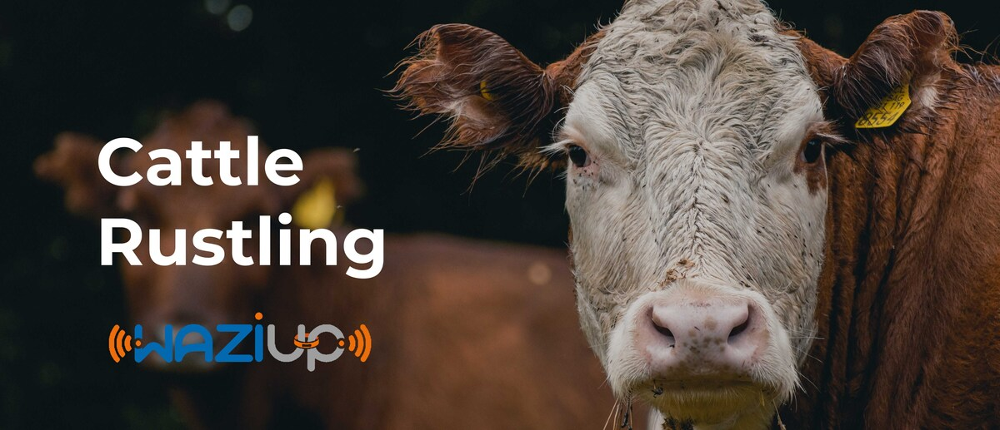

Overview
========
Cattle rustlings is increasingly becoming a major problem in many parts of Africa in recent years. Despite the growing level of cattle theft and its consequences for society, the situation has yet to receive an effective intervention.

In this guided article we will look at how to build a simple tracking solutions for livestock using a method known as **Geofencing**.

Here's what we will be learning:
- What Geofencing means and how it works
- What parts are needed
- How to read and process GPS data
- How to use a GSM shield for text messaging
- How to track objects with Geofencing

What parts do we need?
=====================

To follow this user manual, one will need the following hardware:

Hardware
  - an Arduino Nano with USB mini Cable
  - SIMCOM SIM7000G Breakout Board
  - Flexible 4G LTE and Active Ceramic GPS Antennas
  - Some Jumper Wires
  - LiPo/Li-ion Battery with Holder
  

Software
  - Install the [Arduino IDE](https://www.arduino.cc/en/Main/Software) for the programming aspects.
  - Install [TinyGPSPlus](https://github.com/mikalhart/TinyGPSPlus) library by **Mikal Hart**

**Step \#1:** Installing TinyGPS Plus Library
=============================================
Under the **Sketch** menu in your Arduino IDE, locate **Include Libraries** and navigate to **Manage Libraries..**

**Step \#2:** Reading and Processing GPS Coordinates
====================================================

**Step \#3:** Setting up GSM Text Notifications
===============================================

**Step \#4:** Setting up GeoFencing
===================================

**Step \#5:** Final Touches
===========================