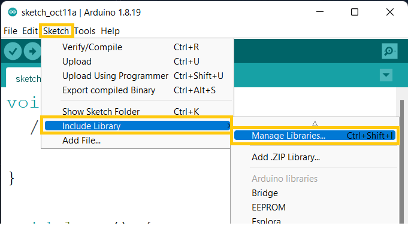

Overview
========
Cattle rustlings is increasingly becoming a major problem in many parts of Africa in recent years. Despite the growing level of cattle theft and its consequences for society, the situation has yet to receive an effective intervention.

In this guided article we will look at how to build a simple tracking solutions for livestock using a method known as **Geofencing**.

Here's what we will be learning:
- What Geofencing means and how it works
- What parts are needed
- How to read and process GPS data
- How to track objects with Geofencing
- How to transmit data collected using LoRa

What parts do we need?
=====================

To follow this user manual, one will need the following hardware:

Hardware
  - Wazidev with USB Mirco Cable
  - Neo 6/7M GPS Breakout Board
  - Active Ceramic GPS Antenna
  - LoRa Gateway with Internet
  - Some Jumper Wires
  - LiPo/Li-ion Battery with Holder
  

Software
  - Install the [Arduino IDE](https://www.arduino.cc/en/Main/Software) for the programming aspects.
  - Install [TinyGPSPlus](https://github.com/mikalhart/TinyGPSPlus) library by **Mikal Hart**

**Step \#1:** Installing TinyGPS Plus Library
=============================================
Under the **Sketch** menu in the Arduino IDE, locate **Include Libraries** and navigate to **Manage Libraries..** and click to open the libraries manager.

Search for **"tinygpsplus"** in the search box and install the version by **Mikal Hart** as shown below

After installing we should see the label INSTALLED **INSTALLED** as shown below.

We can now close the library manager.

**Step \#2:** Reading and Processing GPS Coordinates
====================================================

**Step \#3:** Setting up GSM Text Notifications
===============================================

**Step \#4:** Setting up GeoFencing
===================================

**Step \#5:** Final Touches
===========================