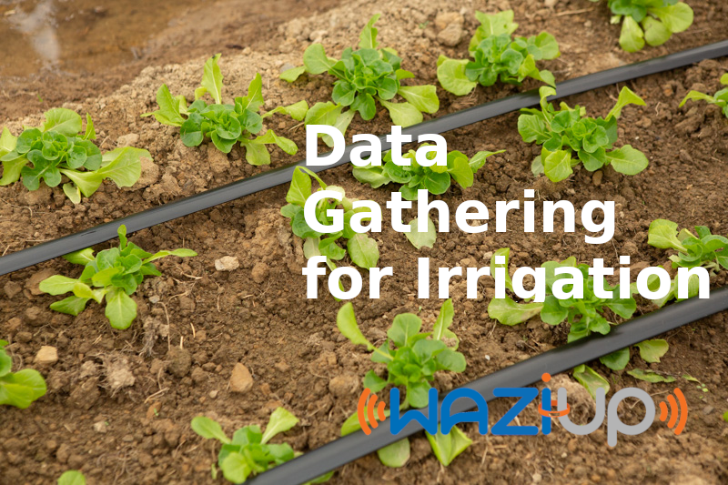
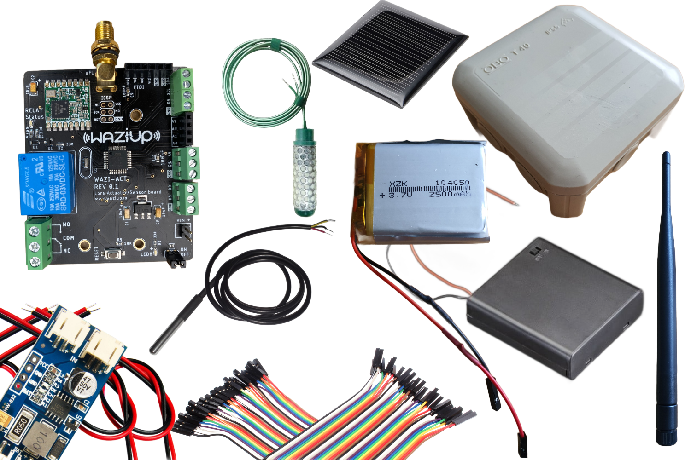
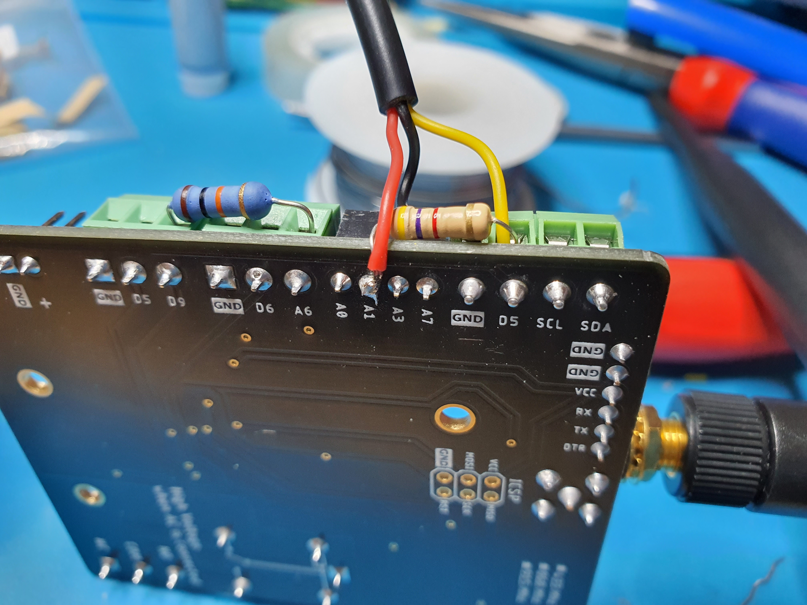
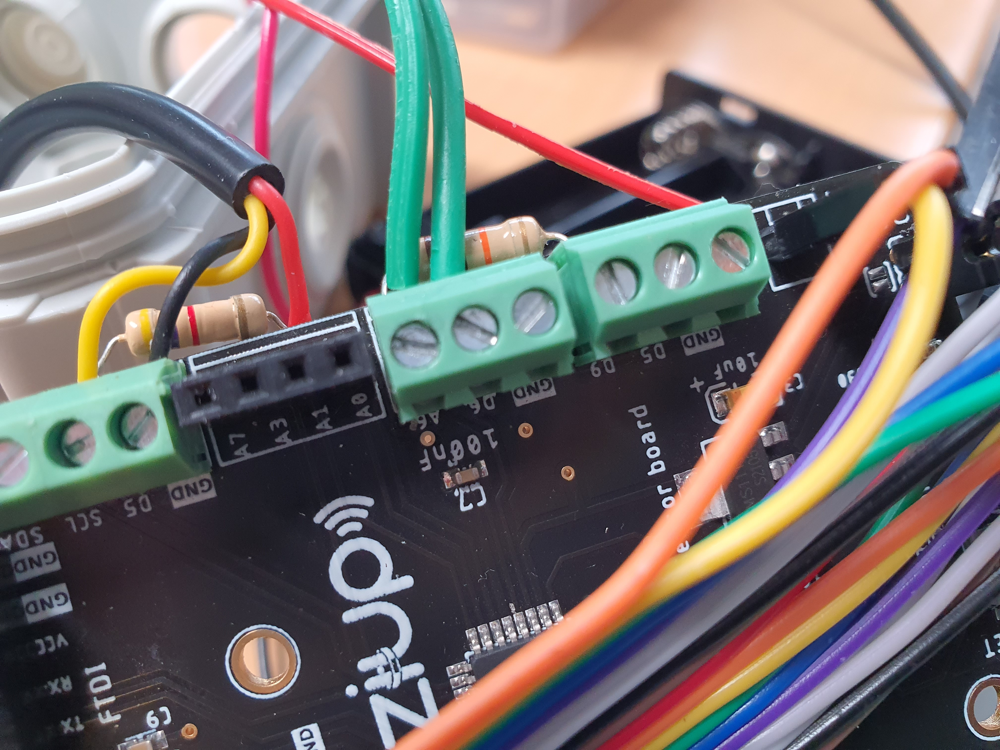
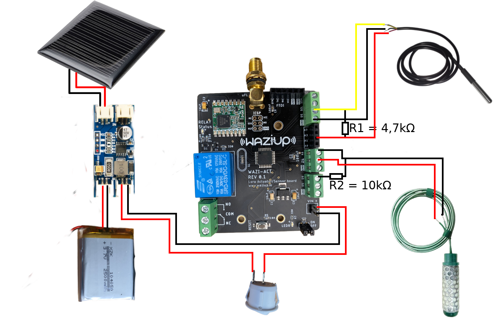
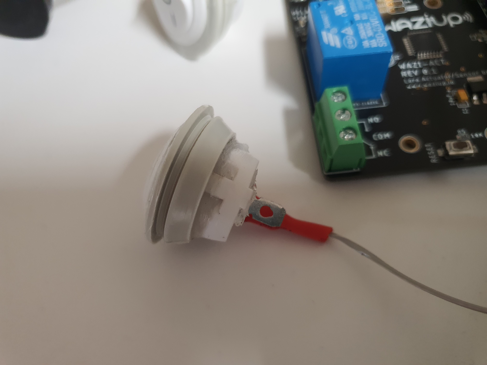
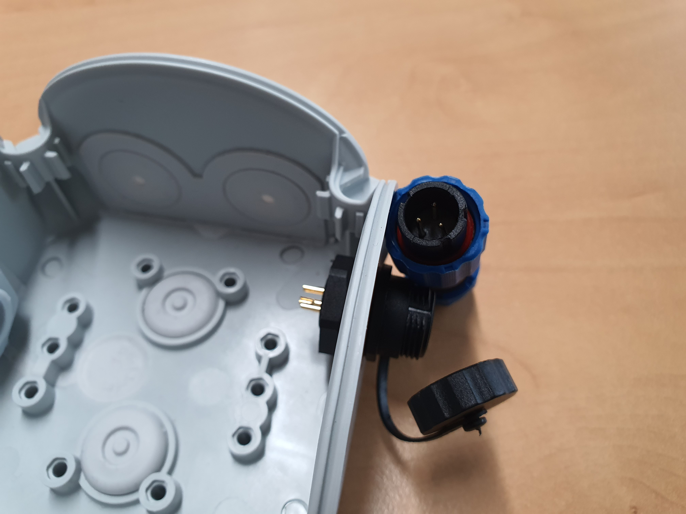

Overview
========

With the help of this guide you will be able to build a device to track moisture and soil temperature. We use it to collect data for different purposes. [Congduc Pham](https://cpham.perso.univ-pau.fr) created similar devices for the [Intel-Irris Project](https://intel-irris.eu), they also got a [github repository](https://github.com/CongducPham/PRIMA-Intel-IrriS). In the OSIRRIS we want to create a dataset, to automate irrigation for a farm. Therefore we use a slightly different configuration to meet the requirements. 

Here's what we will be learning:
- What parts are required
- How to wire up and read sensor values
- How to connect to WaziGate
- How to communicate to the cloud over LoRa
- 

What parts are required?
======================

The following hardware and software is required in order to follow this user guide:

**Hardware:**
- Waziact Board
- Antenna
- Wires and jumpers
- Watermark Sensor (Irrometer)
- DS18B20 temperature sensor 
- 10kOhm resistor, for the Watermark
- 4.7kOhm resistor, for the DS18B20
- (OLED screen)
- Waterproof casings (minimum: IP 55)
- FTDI connector + USB cable
- Ordinary 2-way switch 
- Powering:
  1) Option:
      - 4x AA battery holder 
      - 4x 1,5V AA battery 
  2) Option:
      - MPPT solar charge controller
      - Solar panel 5V, 0,3W 
      - 3,7V LiPo battery with 2500mAh

**Software:**
  - Please install the [Arduino IDE](https://www.arduino.cc/en/Main/Software) for the programming aspects.
  - clone this [git repository](https://github.com/Waziup/OSIRRIS) to get all the dependencies and start right away
  - Follow the guide [here](https://waziup.io/documentation/wazidev/user-manual/#install-the-wazidev-sketchbook) to setup the Arduino IDE with the projects dependencies.

**Step \#1:** Setting up the Soil Moisture Sensor and Soil Temperature Sensor
==============================
For plants to grow consistently and optimally, soil moisture sensors assess the amount of water in the soil.
They can be used to determine whether there is water available within the soil or to measure in other terms measure the moisture of the soil. 

Irrometer Watermark sensors are based on a set of very archaic but thoroughly studied principles. These sensors really absorb soil moisture to ascertain how much pressure is required to get water out of the ground. This number has relatively little application on its own for scheduling irrigation. We can build a complete picture of how much water your crop will have access to before it begins to stress when we account for the soil texture and integrate the information from many sensors at different depths. 

The placement, of the watermark sensor, in the soil is dependent on soil type and crop type. 

In this [guide](https://www.uaex.uada.edu/environment-nature/water/agriculture-irrigation/FSA58%20-%20How%20to%20use.pdf) it is described in further details. 

The [official guide](https://www.irrometer.com/pdf/701.pdf) provides valuable information on how to deploy the sensors in general.

Pin layout
----------
There are only two sensors and two resistors, which will use five pins, that you need to connect to the WaziAct. The DS18B20 uses a analog pin to power the sensor and get the output voltage on an analog pin. The wiring is explained in the following image:

**DS18B20 temperature sensor:**
1. VCC: Connect to the A1 pin of the WaziACT
2. GND: Connect to the GND pin of the WaziACT
3. IN: Connect to the WaziACT analog pin D5
4. Resistor: Connect 4,7 kΩ resistor in between D5 and A1 

Due to space limitations of the box used in this guide, the analog pin has to be soldered from below. 

**Watermark soil tension sensor:**
1. VCC: Connect to D6
2. GND: Connect to A6
3. Resistor: Connect 10kΩ resistor in between A6 and D9

**Connections made to WaziAct:**

The solar panel is connected to the solar charge controllers "IN" port. The first solar charge controllers "OUT" port is connected to the battery directly. The positive of second "OUT" port is connected to to the switch, whereas the minus terminal is connected to the switch, from the switch it should be connected to the positive VIN port of the WaziAct. The negative "OUT" port to the charge controller is connected directly to the negative VIN terminal of the WaziAct. 

For the soil moisture sensor, you have to connect the positive lead (red cable) of the sensor to the "A1" port of the WaziAct. The negative lead is connected to "GND" terminal of the WaziAct. The signal cable (yellow) is connected to the "D5" port of the WaziAct. Additionally you have to bridge "A1" and "D5" with a 4,7kΩ resistor.

The watermark soil moisture sensor is connected with only two wires to the WaziAct. The positive wire is connected to "D6" and the negative is connected to "A6". To acquire accurate readings you have to bridge "A6" to "D9" with a 10kΩ resistor.

A complete schema of how to wire all connections can be obtained from the following:

**Step \#2:** Powering the WaziAct
============================================

The WazAct micro-controller has a very little energy consumption. You can have power supplies from 4V-16V. 
Therefore we came up with two solutions to power the device:

Option 1:
---------

Use a 4x AA battery holder an connect it to the WaziAct directly. We need a minimum of four cells to supply the voltage needed. This option is easy to build and the most cost effective, to collect data over a limited time span.

Option 2:
---------

The second option is to use the sun to power the micro controller, this way, it is self-sufficient. The controller should be able to collect data over years without maintenance. 

We use the following components:
- 5V MPPT solar charge controller
- 5V Solar panel 0,3W 
- 3,7V LiPo battery with 2500mAh (approximately 10Wh)

The solar charge controller tracks the maximum power point and therefore uses the energy, supplied by the solar panel, in an efficient way. It can handle bigger panels, but since our power requirements are very little, we only use a small one. Which brings us to the solar panel, it has only 0,3W. To charge the 10Wh battery from 0-100% SOC, under optimal conditions, would take approximately 34h of direct sunlight. To put this in other words, the battery used is to big, but we still had them on the shelf and we wanted to have a buffer to have the device powered guaranteed. Compared to the WaziSense with its two super capacitors (0,0405Wh), the battery used here (10Wh) can store 250x the energy. So you can use a battery with 10% of the capacity (250mAh) and have still plenty of buffer left.

Additionally we added a switch to control the power state of the device from outside the case. This comes in handy, since we want to waterproof the devices further with silicone, to avoid any failure. But more on that in the next step.

**Step \#3:** Waterproof the Case
====================================================================================

In order to guarantee the water tightness, we conduct additional measures to ensure it. 

Since we have limited space, we cannot use the sealed connectors types. Therefore we applied some usual silicone to all cables that route inside the case from the sensors. Additionally we also applied it to waterproof the switch, the antenna and the lid. The process is shown in the following:

We recommend you to take a bigger case and use waterproof connectors to ensure minimum likelihood of a water/moisture breach. You could use one of the following connector types:

Aviation plug, IP68 SP13 3pin waterproof aviation connector

M20 IP68 Nylon Cable Gland with Locknut

**Step \#4:** Transfer code to the WaziAct
==========================================

The code used in this project is available on the [OSIRRIS github page](https://github.com/Waziup/OSIRRIS). 

1. Clone the project to your PC.
2. Open Arduino IDE and go to File->Preferences and set the "sketchbook path" to "..\OSIRRIS\Arduino". 
3. Open the "\OSIRRIS\Arduino\Osirris_Soil_Sensor\Osirris_Soil_Sensor.ino" file.
4. Adjust the configuration part of the file to fit your needs. At the moment it is set up to work with a watermark and a DS18B20 soil temperature sensor. The device address and the network shared key is the following:
  - device address:       26011DBC
  - network shared key:   23158D3BBC31E6AF670D195B5AED5525

  **Step \#5:** Connect WaziAct to WaziGate
==========================================

In the following all necessary steps to connect a WaziAct to a WaziGate are being explained:

1. To flash the latest version of WaziGate ISO to a sd-card, you can just follow [this guide](https://waziup.io/documentation/wazigate/v2/install/). 
2. Then access the WaziGate using the ip address of the device. 
3. If you are using the WaziGate as an access point, connect your PC/Smartphone to a WIFI with the following SSID: "WAZIGATE_XXXXXXXXX", the address is "42.10.0.1". 
4. If you connected the WaziGate to an access point, connect your PC/Smartphone to the same access point, you can type the assigned ip address. If you have only one WaziGate connected you can access the UI by typing "wazigate.local". 
5. After you logged in, you are on the dashboard page. 
6. There you can press the "+" button (situated in the button right corner) and add a device. 
7. Afterward click on the device. In the next view you have to choose the "XLPP" codec for LoRa transmission. 
8. Then click the three dots (situated in the top right corner), a context menu will open. Here you choose "make LoRaWAN".
9. Add all the information you edited in your arduino script, the stock configuration is the following:
    - device address: 26011DBC
    - network shared key: 23158D3BBC31E6AF670D195B5AED5525
10. Afterwards WaziGate creates all sensors automatically.
11. Rename them and assign units and quantities, to increase visibility.

  **Step \#6** Sync the Sensor Data to WaziCloud
==========================================

The [linked guide](https://waziup.io/documentation/wazicloud/dashboard/) shows how connect and synchronize the WaziGate to WaziCloud. 

