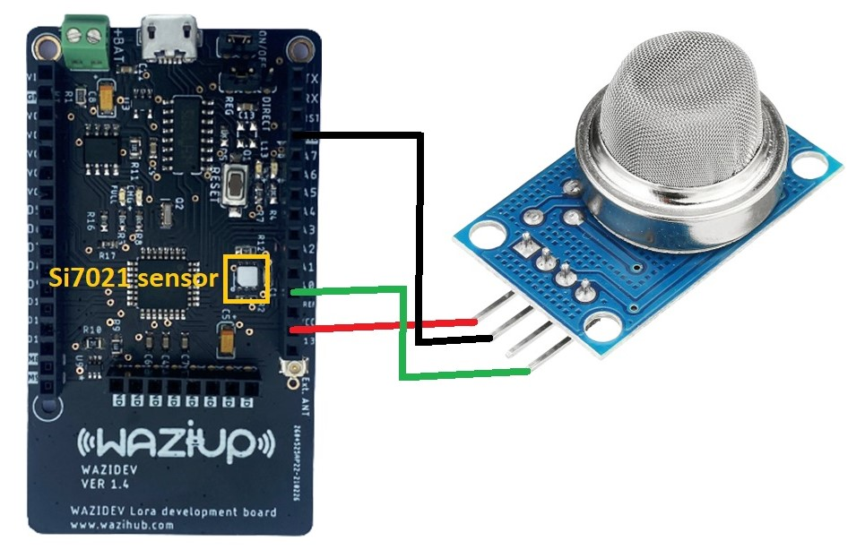
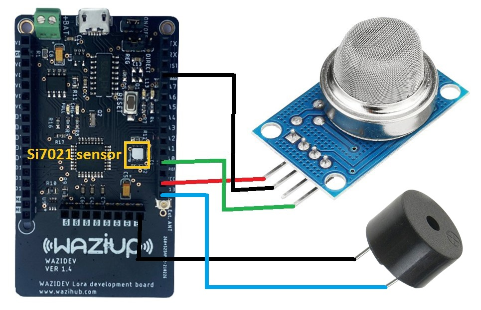
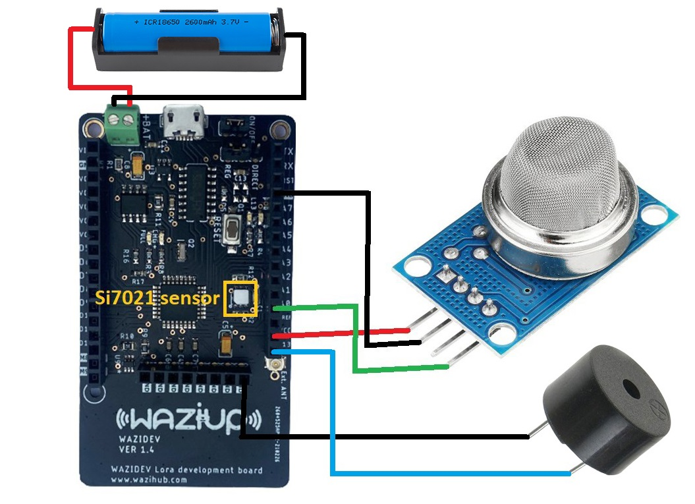

Overview
========

When a fire breaks out, time is of the essence. Prompt measures need to be taken to evacuate the trapped people and contain the fire before it spreads out of hand. However, to accomplish this we need a system that can detect fires before it is too late.

This fully automated fire detection and alarm system is equipped with a temperature, humidity and smoke sensor.

Here's what we will be learning:
- What parts are needed
- How to wire up and read sensor values
- How to trigger an effector(buzzer)
- How to communicate to the cloud over LoRa

What parts do we need?
======================

To follow this user manual, one will need the following hardware:

Hardware
  - WaziDev
  - Micro USB Cable
  - Wazigate
  - MQ5 Gas and Smoke Sensor
  - Some Jumper Wires


Software
  - Install the [Arduino IDE](https://www.arduino.cc/en/Main/Software) for the programming aspects.
  - Install the [WaziDev](https://github.com/Waziup/WaziDev/archive/master.zip) libraries for LoRa communication. Follow the guide [here](https://waziup.io/documentation/wazidev/user-manual/#install-the-wazidev-sketchbook)
  - Install the [Si7021](https://github.com/adafruit/Adafruit_Si7021) digital humidity and temperature sensor library by **Adafruit**

**Step \#1:** Setting MQ5 Gas & Smoke Sensor
============================================
Under the **Sketch** menu in the Arduino IDE, locate **Include Libraries** and navigate to **Manage Libraries..** and click to open the libraries manager.


Search for **"Adafruit_Si7021"** in the search box and install the version by **Adafruit**

After installing we should see the label **INSTALLED** as shown below.


We can now close the library manager.

**Step \#2:** Setting up the MQ5 Sensor
===================================
The MQ5 Gas Sensor module is useful for gas leakage detecting. It can detect LPG, i-butane, methane, alcohol, Hydrogen, smoke and so on.

We can also measure the corresponding temperature of the space where we place our MQ5 sensor. This is because, as more smoke or fire gets trapped in a room, the temperature of the room also increases. Luckily for us, the wazidev has a digital humidity and temperature sensor. Lets put it to work.

Schematics
----------
There are only three pins that you need to worry about on most of these analog sensors. The common principle is to power the sensor and get the output voltage on an analog pin. In our case, we are going to use pin A0.



Module interface:
1. VCC: Connect to the VCC pin of the WaziDev
2. GND: Connect to the GND pin of the WaziDev
3. IN: Connect to the WaziDev analog pin A0

Code Sample
-----------
```c
#include "Adafruit_Si7021.h"

Adafruit_Si7021 sensor = Adafruit_Si7021();

//MQ5 sensor pin
int smokePin = A0;

void setup() {
  Serial.begin(38400);

  Serial.println("Si7021 test!");
  
  //Activate sensor reading
  if (!sensor.begin()) {
    Serial.println("Did not find Si7021 sensor!");
    while (true)
      ;
  }
}

void loop() {
  //Read and Print Smoke Values
  int smokeVal = analogRead(smokePin);
  Serial.print("Smoke: ");
  Serial.print(smokeVal);

  //Read and Print Temp and Humidity Values
  Serial.print(" Humidity: ");
  Serial.print(sensor.readHumidity(), 2);
  Serial.print(" Temperature: ");
  Serial.println(sensor.readTemperature(), 2);

  //Wait 1 second between reads
  delay(1000);
}
```

**Step \#3:** Triggering a Buzzer when Smoke, Gas or Fire is Detected
===============================================================

Users may occasionally be away from their mobile devices, this means they may not see notifications come in from the cloud regarding smoke, gas or fire detection. It is therefore useful to add a buzzer to alert the user.

Lets take a look at how to add a buzzer and add a few more lines of code to manage it.

Schematic
---------



Code Sample
-----------
```c
#include "Adafruit_Si7021.h"

Adafruit_Si7021 sensor = Adafruit_Si7021();

//MQ5 sensor pin
int smokePin = A0;

//Buzzer pin
int buzzer = 13;

//Setting temperature and smoke threshold values
int temp_thresh = 33;
int smoke_thresh = 200;

void setup() {
  //Declaring buzzer pin mode
  pinMode(buzzer, OUTPUT);

  Serial.begin(38400);

  Serial.println("Si7021 test!");

  //Activate sensor reading
  if (!sensor.begin()) {
    Serial.println("Did not find Si7021 sensor!");
    while (true)
      ;
  }
}

void loop() {
  //Read and Print Smoke Values
  int smokeVal = analogRead(smokePin);
  Serial.print("Smoke: ");
  Serial.print(smokeVal);

  //Read and Print Temp and Humidity Values
  float hum = sensor.readHumidity();
  float temp_deg = sensor.readTemperature();

  Serial.print(" Humidity: ");
  Serial.print(hum, 2);
  Serial.print(" Temperature: ");
  Serial.println(temp_deg, 2);

  //Triggering the buzzer if the room is warm, smoke or gas is detected
  if (smokeVal > smoke_thresh || temp_deg > temp_thresh) {
    digitalWrite(buzzer, HIGH);
    delay(1000);
    digitalWrite(buzzer, LOW);
    delay(500);
  }
  //Wait 1 second between reads
  delay(500);
}
```
**Step \#4:** Combining Sensing, Alarm and Lora Communication
=============================================================

At this point, we want to the WaziDev to constantly update Wazicloud with the current state of the Sensors through Wazigate.

**NOTE:** Make sure to have a configured gateway up and running before uploading this next code. Kindly see the lectures under **Module 5 Lecture 2** for how to setup a Waziup Gateway.

In order to make our project mobile, we can add a battery to power the sensor and the Wazidev as shown below.

Schematics
----------


Code Sample
-----------
```c
#include <WaziDev.h>
#include <xlpp.h>
#include <Base64.h>
#include "Adafruit_Si7021.h"

Adafruit_Si7021 sensor = Adafruit_Si7021();

//MQ5 sensor pin
int smokePin = A0;

//Buzzer pin
int buzzer = 13;

//Setting temperature and smoke threshold values
int temp_thresh = 33;
int smoke_thresh = 200;
// NwkSKey (Network Session Key) and Appkey (AppKey) are used for securing LoRaWAN transmissions.
// You need to copy them from/to your LoRaWAN server or gateway.
// You need to configure also the devAddr. DevAddr need to be different for each devices!!
// Copy'n'paste the DevAddr (Device Address): 26011D00
unsigned char devAddr[4] = {0x26, 0x01, 0x1D, 0x00};

// Copy'n'paste the key to your Wazigate: 23158D3BBC31E6AF670D195B5AED5525
unsigned char appSkey[16] = {0x23, 0x15, 0x8D, 0x3B, 0xBC, 0x31, 0xE6, 0xAF, 0x67, 0x0D, 0x19, 0x5B, 0x5A, 0xED, 0x55, 0x25};

// Copy'n'paste the key to your Wazigate: 23158D3BBC31E6AF670D195B5AED5525
unsigned char nwkSkey[16] = {0x23, 0x15, 0x8D, 0x3B, 0xBC, 0x31, 0xE6, 0xAF, 0x67, 0x0D, 0x19, 0x5B, 0x5A, 0xED, 0x55, 0x25};

WaziDev wazidev;

void setup()
{
  Serial.begin(38400);
  wazidev.setupLoRaWAN(devAddr, appSkey, nwkSkey);
  
  //Declaring buzzer pin mode
  pinMode(buzzer, OUTPUT);

  Serial.println("Si7021 test!");

  //Activate sensor reading
  if (!sensor.begin()) {
    Serial.println("Did not find Si7021 sensor!");
    while (true)
      ;
  }
  
}

XLPP xlpp(120);

void loop(void)
{
  //Read and Print Smoke Values
  int smokeVal = analogRead(smokePin);
  Serial.print("Smoke: ");
  Serial.print(smokeVal);

  //Read and Print Temp and Humidity Values
  float hum = sensor.readHumidity();
  float temp_deg = sensor.readTemperature();

  Serial.print(" Humidity: ");
  Serial.print(hum, 2);
  Serial.print(" Temperature: ");
  Serial.println(temp_deg, 2);

  //Triggering the buzzer if the room is warm, smoke or gas is detected
  if (smokeVal > smoke_thresh || temp_deg > temp_thresh) {
    digitalWrite(buzzer, HIGH);
    delay(1000);
    digitalWrite(buzzer, LOW);
    delay(500);
  }
  
  // 1
  // Create xlpp payload.
  
  xlpp.reset();
  
  xlpp.addTemperature(1,temp_deg);
  xlpp.addRelativeHumidity(1, hum);
  xlpp.addTemperature(2, smokeVal); //rename this temperature sensor on wazigate as smoke or to what you prefer
  
  // 2.
  // Send paload with LoRaWAN.
  serialPrintf("LoRaWAN send ... ");
  uint8_t e = wazidev.sendLoRaWAN(xlpp.buf, xlpp.len);
  if (e != 0)
  {
    serialPrintf("Err %d\n", e);
    delay(60000);
    return;
  }
  serialPrintf("OK\n");
  
  // 3.
  // Receive LoRaWAN message (waiting for 6 seconds only).
  serialPrintf("LoRa receive ... ");
  uint8_t offs = 0;
  long startSend = millis();
  e = wazidev.receiveLoRaWAN(xlpp.buf, &xlpp.offset, &xlpp.len, 6000);
  long endSend = millis();
  if (e != 0)
  {
    if (e == ERR_LORA_TIMEOUT){
      serialPrintf("nothing received\n");
    }
    else
    {
      serialPrintf("Err %d\n", e);
    }
    delay(60000);
    return;
  }
  serialPrintf("OK\n");
  
  serialPrintf("Time On Air: %d ms\n", endSend-startSend);
  serialPrintf("LoRa SNR: %d\n", wazidev.loRaSNR);
  serialPrintf("LoRa RSSI: %d\n", wazidev.loRaRSSI);
  serialPrintf("LoRaWAN frame size: %d\n", xlpp.offset+xlpp.len);
  serialPrintf("LoRaWAN payload len: %d\n", xlpp.len);
  serialPrintf("Payload: ");
  char payload[100];
  base64_decode(payload, xlpp.getBuffer(), xlpp.len); 
  serialPrintf(payload);
  serialPrintf("\n");
  
  delay(5000);
}
```

At this point, all we need to do is flash the above code to the Wazidev and place the entire unit in our desired room/space for sensing.

we can also setup notifications on WaziCloud, for when the temperature, smoke or gas threshold conditions are met. Kindly see the lectures under **Module 5 Lecture 3** for how to setup a Notifications on Wazicloud.