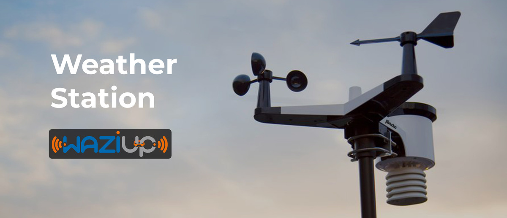
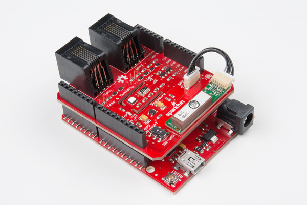
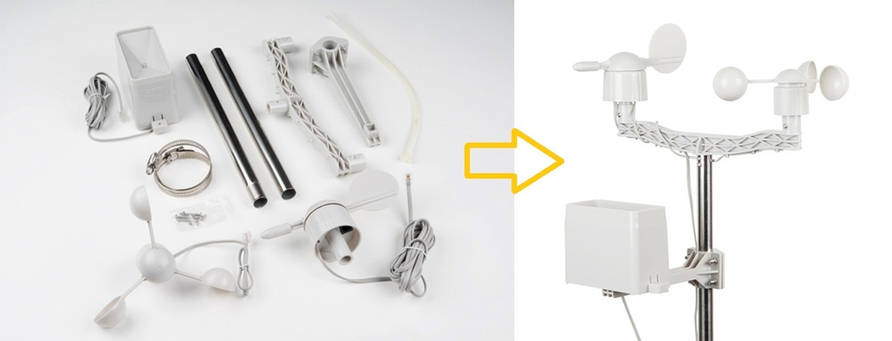
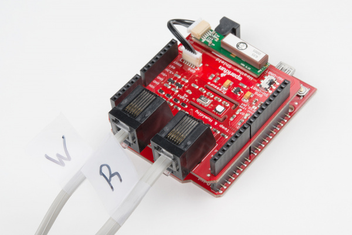
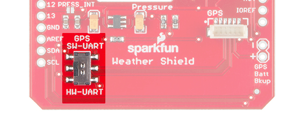

Overview
========
A weather station is a facility, either on land or sea, with instruments and equipment for measuring atmospheric conditions to provide information for weather forecasts and to study the weather and climate.

In recent years weather stations have become increasingly porpular among DIYers but the issue has always been with how to build a low-cost but functional station. In this guide, we will look at how to build a weather staion from scratch. 

We will be using The **Arduino Weather Shield** from [Sparkfun](https://learn.sparkfun.com/tutorials/arduino-weather-shield-hookup-guide-v12/all). This is an easy-to-use Arduino shield that grants you access to barometric pressure, relative humidity, luminosity, and temperature. There are also connections to optional sensors such as wind speed/direction, rain gauge, and GPS for location and super accurate timing.

Here's what we will be learning:
- How to read atmospheric sensor data (barometric pressure, relative humidity, luminosity, and temperature)
- How to read wind speed/direction, rain gauge, and GPS
- How to process all sensor data
- How to transmit sensor data to Wazicloud using LoRa

What parts do we need?
======================
To follow this user manual, one will need the following hardware and software:

Hardware
- SparkFun Weather Shield Kit
- SparkFun Weather Meter Kit
- Arduino Uno with USB Cable
- Lora SX1276 Breakout Board
- Waziup Gateway
- Some Jumper Wires
- Power Supply


Things you should know about the Sparkfun Weather shield:

- It Uses the [Si7021](https://www.sparkfun.com/products/13763) sensor, [MPL3115A2 barometric pressure](https://www.sparkfun.com/products/11084?_ga=2.39980774.510170626.1666488566-160177867.1666172664) sensor, and [ALS-PT19 light](https://www.sparkfun.com/products/12566?_ga=2.39980774.510170626.1666488566-160177867.1666172664) sensor.
- Has connector for the [GP-735 compact GPS module](https://www.sparkfun.com/products/13670?_ga=2.216133586.510170626.1666488566-160177867.1666172664)
- Has optional [RJ11 connector](https://www.sparkfun.com/products/132?_ga=2.203755092.510170626.1666488566-160177867.1666172664) footprints to connect the [SparkFun weather meters](https://www.sparkfun.com/products/15901)
- Weather shield can operate from 3V to 10V and has built in voltage regulators and signal translators
- Typical humidity accuracy of ±2%
- Typical pressure accuracy of ±50Pa
- Typical temperature accuracy of ±0.3C

Software
  - Install the [Arduino IDE](https://www.arduino.cc/en/Main/Software) for the programming aspects.
  - Install [TinyGPSPlus](https://github.com/mikalhart/TinyGPSPlus) library by **Mikal Hart**
  - Install the [WaziDev](https://github.com/Waziup/WaziDev/archive/master.zip) libraries for LoRa communication. Follow the guide [here](https://waziup.io/documentation/wazidev/user-manual/#install-the-wazidev-sketchbook)
  - Install [SparkFunMPL3115A2](https://github.com/sparkfun/MPL3115A2_Breakout/tree/master/Libraries/Arduino)library by **Sparkfun**
  - Install [SparkFun_Si7021_Breakout_Library](https://github.com/sparkfun/SparkFun_Si7021_Arduino_Library)library by **Sparkfun**

**Step \#1:** Assembling Weather Station
========================================

To get our weather station up and running, we need to:
- Stack the weather shield on top of the Arduino Uno as shown below. Connect the GPS module as well.



- Assemble the weather meters using the guide [here](https://learn.sparkfun.com/tutorials/weather-meter-hookup-guide) as shown below.



- Connect the weather meters to the weather shield as shown below.




**Step \#2:** Trying a Basic Weather Station
========================================

**NOTE:** Before uploading code to your Arduino with the Weather Shield attached, make sure the GPS UART switch is in the **SW-UART** position. Having the switch in the opposite position connects the GPS lines to the USB lines and may cause errors while uploading. 



Code Sample
-----------

```````c
/*
 Weather Shield Example
 By: Nathan Seidle
 SparkFun Electronics
 Date: June 10th, 2016
 License: This code is public domain but you buy me a beer if you use this and we meet someday (Beerware license).

 This example prints the current humidity, air pressure, temperature and light levels.

 The weather shield is capable of a lot. Be sure to checkout the other more advanced examples for creating
 your own weather station.

 Updated by Joel Bartlett
 03/02/2017
 Removed HTU21D code and replaced with Si7021
 */

#include <Wire.h> //I2C needed for sensors
#include "SparkFunMPL3115A2.h" //Pressure sensor - Search "SparkFun MPL3115" and install from Library Manager
#include "SparkFun_Si7021_Breakout_Library.h" //Humidity sensor - Search "SparkFun Si7021" and install from Library Manager

MPL3115A2 myPressure; //Create an instance of the pressure sensor
Weather myHumidity;//Create an instance of the humidity sensor

//Hardware pin definitions
//-=-=-=-=-=-=-=-=-=-=-=-=-=-=-=-=-=-=-=-=-=-=-=-=-=-=-=-=
const byte STAT_BLUE = 7;
const byte STAT_GREEN = 8;

const byte REFERENCE_3V3 = A3;
const byte LIGHT = A1;
const byte BATT = A2;

//Global Variables
//-=-=-=-=-=-=-=-=-=-=-=-=-=-=-=-=-=-=-=-=-=-=-=-=-=-=-=-=
long lastSecond; //The millis counter to see when a second rolls by

void setup()
{
  Serial.begin(9600);
  Serial.println("Weather Shield Example");

  pinMode(STAT_BLUE, OUTPUT); //Status LED Blue
  pinMode(STAT_GREEN, OUTPUT); //Status LED Green

  pinMode(REFERENCE_3V3, INPUT);
  pinMode(LIGHT, INPUT);

  //Configure the pressure sensor
  myPressure.begin(); // Get sensor online
  myPressure.setModeBarometer(); // Measure pressure in Pascals from 20 to 110 kPa
  myPressure.setOversampleRate(7); // Set Oversample to the recommended 128
  myPressure.enableEventFlags(); // Enable all three pressure and temp event flags

  //Configure the humidity sensor
  myHumidity.begin();

  lastSecond = millis();

  Serial.println("Weather Shield online!");
}

void loop()
{
  //Print readings every second
  if (millis() - lastSecond >= 1000)
  {
    digitalWrite(STAT_BLUE, HIGH); //Blink stat LED

    lastSecond += 1000;

    //Check Humidity Sensor
    float humidity = myHumidity.getRH();

    if (humidity == 998) //Humidty sensor failed to respond
    {
      Serial.println("I2C communication to sensors is not working. Check solder connections.");

      //Try re-initializing the I2C comm and the sensors
      myPressure.begin(); 
      myPressure.setModeBarometer();
      myPressure.setOversampleRate(7);
      myPressure.enableEventFlags();
      myHumidity.begin();
    }
    else
    {
      Serial.print("Humidity = ");
      Serial.print(humidity);
      Serial.print("%,");
      float temp_h = myHumidity.getTempF();
      Serial.print(" temp_h = ");
      Serial.print(temp_h, 2);
      Serial.print("F,");

      //Check Pressure Sensor
      float pressure = myPressure.readPressure();
      Serial.print(" Pressure = ");
      Serial.print(pressure);
      Serial.print("Pa,");

      //Check tempf from pressure sensor
      float tempf = myPressure.readTempF();
      Serial.print(" temp_p = ");
      Serial.print(tempf, 2);
      Serial.print("F,");

      //Check light sensor
      float light_lvl = get_light_level();
      Serial.print(" light_lvl = ");
      Serial.print(light_lvl);
      Serial.print("V,");

      //Check batt level
      float batt_lvl = get_battery_level();
      Serial.print(" VinPin = ");
      Serial.print(batt_lvl);
      Serial.print("V");

      Serial.println();
    }

    digitalWrite(STAT_BLUE, LOW); //Turn off stat LED
  }

  delay(100);
}

//Returns the voltage of the light sensor based on the 3.3V rail
//This allows us to ignore what VCC might be (an Arduino plugged into USB has VCC of 4.5 to 5.2V)
float get_light_level()
{
  float operatingVoltage = analogRead(REFERENCE_3V3);

  float lightSensor = analogRead(LIGHT);

  operatingVoltage = 3.3 / operatingVoltage; //The reference voltage is 3.3V

  lightSensor = operatingVoltage * lightSensor;

  return (lightSensor);
}

//Returns the voltage of the raw pin based on the 3.3V rail
//This allows us to ignore what VCC might be (an Arduino plugged into USB has VCC of 4.5 to 5.2V)
//Battery level is connected to the RAW pin on Arduino and is fed through two 5% resistors:
//3.9K on the high side (R1), and 1K on the low side (R2)
float get_battery_level()
{
  float operatingVoltage = analogRead(REFERENCE_3V3);

  float rawVoltage = analogRead(BATT);

  operatingVoltage = 3.30 / operatingVoltage; //The reference voltage is 3.3V

  rawVoltage = operatingVoltage * rawVoltage; //Convert the 0 to 1023 int to actual voltage on BATT pin

  rawVoltage *= 4.90; //(3.9k+1k)/1k - multiple BATT voltage by the voltage divider to get actual system voltage

  return (rawVoltage);
}
```````

Cheers!!