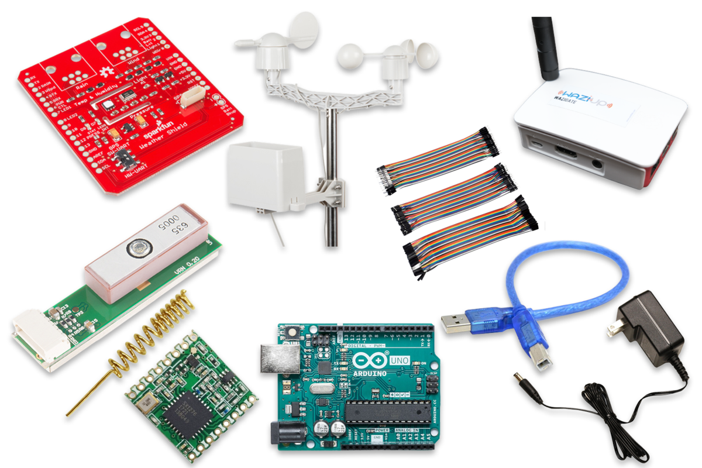

Overview
========
A weather station is a facility, either on land or sea, with instruments and equipment for measuring atmospheric conditions to provide information for weather forecasts and to study the weather and climate.

In recent years weather stations have become increasingly porpular among DIYers but the issue has always been with how to build a low-cost but functional station. In this guide, we will look at how to build a weather staion from scratch. 

We will be using The **Arduino Weather Shield** from [Sparkfun](https://learn.sparkfun.com/tutorials/arduino-weather-shield-hookup-guide-v12/all). This is an easy-to-use Arduino shield that grants you access to barometric pressure, relative humidity, luminosity, and temperature. There are also connections to optional sensors such as wind speed/direction, rain gauge, and GPS for location and super accurate timing.

Here's what we will be learning:
- How to read atmospheric sensor data (barometric pressure, relative humidity, luminosity, and temperature)
- How to read wind speed/direction, rain gauge, and GPS
- How to process all sensor data
- How to transmit sensor data to Wazicloud using LoRa

What parts do we need?
======================
To follow this user manual, one will need the following hardware and Software:

Hardware
- SparkFun Weather Shield Kit
- SparkFun Weather Meter Kit
- Arduino Uno with USB Cable
- Lora SX1276 Breakout Board
- Waziup Gateway
- Some Jumper Wires
- Power Supply

Software
  - Install the [Arduino IDE](https://www.arduino.cc/en/Main/Software) for the programming aspects.
  - Install [TinyGPSPlus](https://github.com/mikalhart/TinyGPSPlus) library by **Mikal Hart**
  - Install the [WaziDev](https://github.com/Waziup/WaziDev/archive/master.zip) libraries for LoRa communication. Follow the guide [here](https://waziup.io/documentation/wazidev/user-manual/#install-the-wazidev-sketchbook)

**Step \#1:** Installing TinyGPS Plus Library

Cheers!!